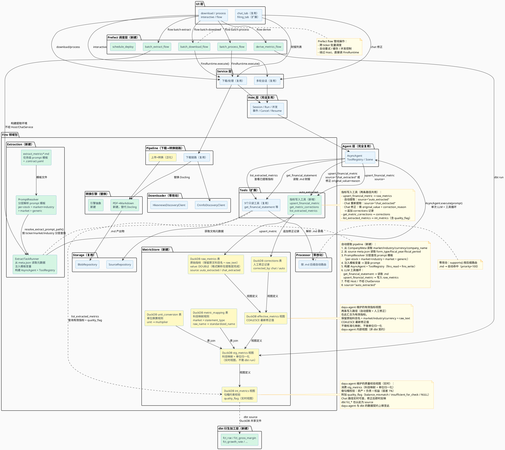
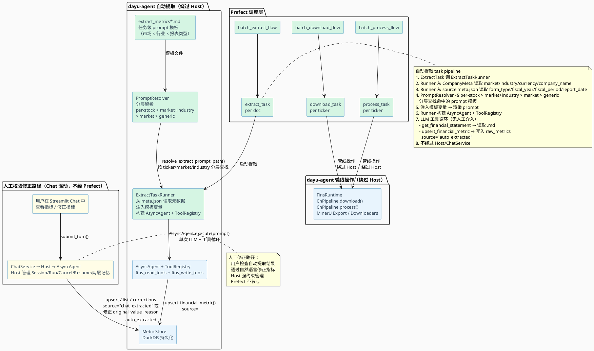
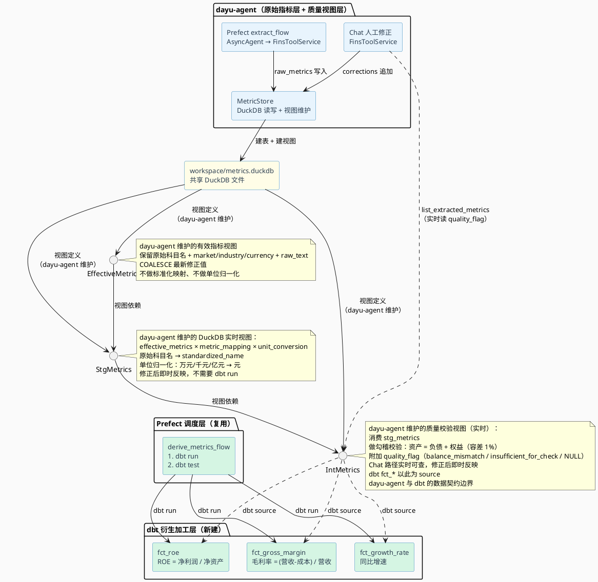

# 财报智能处理平台 PRD

> **版本**：v5.5  
> **日期**：2026-08-10  
> **状态**：草案  
> **目标市场**：A股、港股  
> **基础平台**：直接基于 dayu-agent 扩展  
> **调度层**：Prefect（pipeline 自动化编排）  
> **分析层**：DuckDB + dbt（指标衍生加工）  

---

## 1. 背景与目标

### 1.1 背景

A股与港股的财报数据散落在巨潮资讯网（A股）、披露易（港股）等公开平台，以 PDF 为主，格式不统一、表格结构差异大。dayu-agent 已经具备完整的财报下载链路和多轮交互分析能力，但存在两个限制：

- **PDF 转换引擎受限**：当前使用 Docling 将 PDF 转为结构化 JSON，对中文财报表格还原度不够理想
- **缺少结构化指标提取与修正闭环**：当前 FinsToolService 全部只读，无法通过 Chat 指令修正已提取的指标

### 1.2 目标

本项目的核心目标是在 dayu-agent 内部完成三件事：

1. **Docling → MinerU 替换**：将 PDF 转 Markdown 的底层引擎从 Docling 替换为 MinerU，提升中文财报表格还原质量
2. **指标提取与人工修正闭环**：复用 dayu-agent 的 Chat + Streamlit + Agent + Host 全栈能力，通过工具注入实现自然语言驱动的指标提取和修正
3. **Prefect 调度层集成**：使用 Prefect 实现 pipeline 的自动化调度，支持跨 ticker 批量下载、转换、指标提取，提供重试、缓存、并发控制、定时调度能力

**一期重心**（当前版本）：

1. MinerU 集成：新建 MinerU 转换模块，替换 Docling 作为 PDF → Markdown 的转换引擎
2. 指标提取：通过 Agent + scene + 工具注入，让 LLM 从转换后的 Markdown 财报中提取标准化指标
3. 指标修正：复用 ChatService 多轮会话 + Streamlit Chat UI，通过写工具注入实现自然语言驱动的指标修正
4. Streamlit 展示：扩展 Streamlit 页面，展示已提取指标和修正历史
5. Prefect 调度：新建 Prefect flow/task 层，包装 download/process/指标提取等管线操作，实现批量自动化调度
6. 衍生指标加工：基于 DuckDB + dbt 实现衍生指标计算 pipeline，与原始指标共享 DuckDB 文件，由 Prefect 统一调度

**二期展望**（不在本期范围）：

- 衍生指标自动生成（从指标定义模板自动生成 dbt fct_* model 和 metric_mapping CSV）
- 多维指标组合选股
- 自动化数据质量验证规则引擎
- 衍生指标 Streamlit 可视化展示
- 跨市场衍生计算（含汇率换算）

### 1.3 关键架构决策：直接基于 dayu-agent 扩展

#### 1.3.1 决策理由

dayu-agent 已有的 `UI → Service → Host → Agent` 四层架构天然支撑本项目需求：

| 需求环节 | dayu-agent 已有能力 | 复用方式 |
|---------|---------------------|---------|
| 财报下载 | A股巨潮下载器、港股披露易下载器、CN pipeline 完整链路、ticker 归一化（`normalize_ticker` → market/company_id 自动推导）、ticker_aliases 容错查询、并发治理、中断恢复 | **零改动**（ticker 归一化真源复用） |
| PDF 转 Markdown | Docling 转换引擎已收敛到 `docling_export.py` 单一入口，`ProcessorRegistry` 按后缀自动路由 | **替换底层引擎**，上层自动切换 |
| 指标提取 | Agent + Host + scene manifest + 工具注入体系完整 | **新增工具 + 新增 scene** |
| 人工修正 | ChatService 多轮会话、Streamlit 流式 Chat UI、工具注入机制 | **新增写工具 + 扩展 scene** |
| Streamlit 展示 | filing_tab 已有财报列表展示、chat_tab 已有流式对话 | **扩展页面** |
| 批量调度 | 无内置批处理/定时调度框架 | **集成 Prefect**（新建调度层） |

#### 1.3.2 Docling → MinerU 替换可行性

dayu-agent 的 Docling 集成已经高度收敛，替换为 MinerU 的改动集中在 `fins/pipelines` 层，不触及 `engine/processors` 和 `fins/processors`：

**收敛点分析**：

| 层级 | 现状 | 替换影响 |
|------|------|---------|
| 转换入口 | `dayu/fins/docling_export.py` 是唯一收敛点，导出 `convert_pdf_bytes_to_docling_json_bytes()` | 新建 `mineru_export.py` 替代 |
| 转换运行时 | `dayu/docling_runtime.py` 672 行，含二维回退策略 | 新建 MinerU 运行时模块 |
| 下载链路注入 | `CnPipeline.__init__` 默认注入 `convert_pdf_bytes_to_docling_json_bytes`，`PdfToDoclingJsonBytes = Callable[[bytes, str], bytes]` | 改注入函数和类型别名 |
| 产出物 | `_docling.json`（结构化 JSON），被 `DoclingProcessor.supports()` 按后缀路由 | 变为 `.md`，被 `MarkdownProcessor.supports()` 按后缀路由 |
| Upload 链路 | `DoclingUploadService` 内部调用 `convert_pdf_bytes_to_docling_payload()` | 类名和内部调用泛化 |
| source upsert 校验 | `cn_download_source_upsert.py:238` 硬校验 `primary_document.endswith("_docling.json")` | **必须放宽**为允许 `.md` |
| Processor 路由 | `ProcessorRegistry` 按 `supports()` 匹配后缀，priority 排序 | **零改动**：`.md` 自动命中 `FinsMarkdownProcessor`(priority=100) |
| FinsMarkdownProcessor | `relabel_tables(self._tables)` 已走无 Docling 依赖路径 | **零改动** |
| FinsToolService | `_create_processor()` 通过 `get_primary_source()` 读 `primary_document` 指向的文件 | **零改动** |
| web_fetch 链路 | `web_fetch_orchestrator.py` 独立调用 Docling 转 Markdown | **可选改动**，不影响 fins 链路 |

**关键结论**：

1. `ProcessorRegistry` 的 `supports()` 机制天然支持引擎切换——产出物从 `_docling.json` 变为 `.md` 后，`FinsDoclingProcessor` 不再被命中，`FinsMarkdownProcessor` 自动接管
2. `FinsMarkdownProcessor` 已经完整支持 Markdown 处理（含 `relabel_tables`），不需要任何修改
3. `FinsToolService` 的 processor 路由逻辑完全不需要改
4. `engine/processors/` 层完全不需要改

#### 1.3.3 替换改动量估算

| 改动区域 | 改动量 | 说明 |
|---------|--------|------|
| 新建 MinerU 运行时模块 | ~250 行 | `dayu/fins/mineru_export.py`，提供 `convert_pdf_bytes_to_markdown_bytes(raw_data, stream_name) -> bytes`，内含 PDF 拆分 → MinerU 转换 → Markdown 合并 |
| 转换引擎抽象 | ~40 行 | 新建 `dayu/fins/conversion_engine.py`，定义 `PdfToConvertedBytes` 类型别名 + 配置驱动选择 Docling 或 MinerU |
| CnPipeline 改造 | ~30 行 | `cn_pipeline.py` 通用化转换函数注入点，默认改为 MinerU |
| Cn download filing workflow | ~40 行 | `cn_download_filing_workflow.py` 产出物后缀从 `_docling.json` 改为 `.md`，`content_type` 从 `application/json` 改为 `text/markdown` |
| Cn download source upsert | ~10 行 | `cn_download_source_upsert.py` 放宽 `primary_document` 硬校验，允许 `.md` 后缀 |
| Cn download staging | ~20 行 | `cn_download_staging.py` 字段名从 `has_docling_json` / `docling_json_bytes` 泛化 |
| Cn download rebuild | ~20 行 | `cn_download_rebuild.py` 的 `_DOCLING_SUFFIX` 常量和引用泛化 |
| Cn download models | ~5 行 | `cn_download_models.py` 的 stage 名从 `"docling_converted"` 改为 `"converted"` |
| Cn download protocols | ~10 行 | `cn_download_protocols.py` 的 property 名和类型泛化 |
| Upload Service 泛化 | ~30 行 | `docling_upload_service.py` 类名 → `ConvertedUploadService`，`DOCLING_FILE_SUFFIX` → `CONVERTED_FILE_SUFFIX`，内部方法名泛化 |
| SEC pipeline / upload workflow | ~10 行 | 导入和实例化类名同步 |
| 配置项新增 | ~5 行 | `run.json` 新增 `conversion_engine: "mineru"` |
| 测试更新 | ~300 行 | 受影响测试文件适配新后缀和新函数名 |
| **总计** | **~770 行** | 其中新代码 ~290 行，改动 ~200 行，测试 ~300 行 |

#### 1.3.4 Chat + Streamlit 复用可行性

dayu-agent 已有的 Chat + Streamlit 栈完整覆盖"人工修正"场景：

| 能力 | 现有实现 | 修正场景复用方式 |
|------|---------|----------------|
| 多轮会话 | `ChatService.submit_turn()` → Host 两层记忆模型（Pinned State + 单总池）| 用户在 Chat 中指示修正，LLM 调用写工具执行 |
| 流式展示 | `chat_tab.py` 后台线程 + Queue 桥接 async event stream → Streamlit `@st.fragment(run_every=0.5)` 轮询 | **零改动**，修正过程天然流式展示 |
| 会话恢复 | `resume_pending_turn()` + `list_resumable_pending_turns()` | **零改动** |
| 历史加载 | `list_conversation_session_turn_excerpts()` | **零改动** |
| 工具注入 | `toolset_registrars.json` → `register_fins_read_toolset()` | **新增写工具**到同一 registrar |
| Scene 管理 | `prompts/manifests/interactive.json` + `prompts/scenes/interactive.md` | **扩展或新增 scene** |
| 财报读取 | `FinsToolService` 9 个只读工具（`get_financial_statement` / `read_section` / `get_table` 等）| **零改动**，LLM 修正时先读后写 |
| Streamlit 财报列表 | `filing_tab.py` DataFrame 展示已下载财报 | **扩展**展示指标和修正历史 |

**关键结论**：人工修正功能不需要新建任何 CLI 命令、不需要新建 Service、不需要新建 UI 框架，只需要：

1. 在 `FinsToolService` 新增写方法（注入写仓储）
2. 在 `fins_tools.py` 新增写工具注册
3. 在 `prompts/` 新增或扩展 scene
4. 在 `streamlit/pages/` 扩展展示页面

---

## 2. 整体架构

### 2.1 架构总览

直接在 dayu-agent 四层架构内扩展，新增 Prefect 调度层作为最上层编排：



### 2.2 分层职责

| 层 | 职责 | 改动状态 |
|----|------|---------|
| **Prefect 调度层** | 跨 ticker 批量编排、重试、缓存、并发控制、定时调度 | **新建** |
| **UI 层** | CLI 命令分发（含新增 `flow` 子命令）；Streamlit Web 交互 | 复用 + 扩展 |
| **Service 层** | FinsService 管线调度、ChatService 多轮会话 | 完全复用 |
| **Host 层** | Session/Run/并发/事件/Cancel/Resume 九项能力 | 完全复用 |
| **Agent 层** | 消息交互、工具调用、流式事件 | 完全复用 |
| **转换引擎** | PDF → Markdown 转换 | **新建 MinerU 模块，替换 Docling** |
| **Pipeline 层** | 下载→转换流水线编排 | 泛化转换注入点 |
| **Processor 层** | Markdown 处理器 | **零改动**（自动按后缀路由） |
| **Storage 层** | 文件系统落盘、元数据管理（含 industry/currency）、DuckDB 指标存储（含质量视图层） | 复用 + 扩展 CompanyMeta + 新增 MetricStore |
| **Downloader 层** | 远端财报发现与 PDF 下载 | 完全复用 |
| **Tools 层** | 财报读取工具 + 指标写入工具（值格式解析通过 schema + prompt 约束）（两条路径共用） | 复用只读工具 + 新增写工具 |
| **Extraction 层** | 自动提取 pipeline（prompt 分层解析 + 模板变量注入 + 值提取规则 + Agent 执行器） | **新建** |
| **Scene 层** | 交互场景 prompt 装配 | 复用 interactive scene + 可选新增 scene |
| **质量视图层** | stg_metrics（科目映射 + 单位归一化）→ int_metrics（勾稽校验 + quality_flag），DuckDB 实时视图，dayu-agent 维护 | **新建** |
| **dbt 衍生层** | fct_*（ROE / 毛利率 / 增速等），source 为 `int_metrics` | **新建** |

### 2.3 设计原则

1. **直接扩展，不新建项目**：所有改动在 dayu-agent 内部完成
2. **引擎替换，不改接口**：MinerU 替换 Docling 只改底层实现，上层通过配置驱动选择
3. **Host 托管一切**：指标提取和人工修正都走 Host 托管，享有 Session/Run/并发/事件/Cancel/Resume
4. **Agent 驱动 LLM**：通过 Agent + scene + 工具注入实现，不绕过 Host 直调 LLM API
5. **ProcessorRegistry 自动路由**：产出物后缀变化后，processor 自动切换，不需要改 processor 层代码
6. **读写工具分离**：只读工具标签 `fins`，写工具标签 `fins_write`，通过 scene manifest 控制启用
7. **Prefect 编排管线操作，Host 托管 Agent 交互**：Prefect 负责 download/process/指标提取等管线操作的编排、重试、并发、调度；Host 负责 LLM Agent 交互的 Session/Run/并发/取消/恢复。两者职责不重叠。
8. **元数据跨阶段流转**：`CompanyMeta`（ticker/market/company_id/ticker_aliases/industry/currency）和 source `meta.json`（form_type/fiscal_year/fiscal_period）在下载阶段写入，转换阶段更新 `primary_document`，提取阶段读取注入 prompt 模板。不重复存储、不跨源猜测。
9. **Ticker 归一化是 market 的唯一真源**：`market` 由 `normalize_ticker()` 从 ticker 形态自动推导，不需要 CLI 显式传入 `--market`。`industry` / `currency` 与 `market` 并列存储在 `CompanyMeta` 中，三者共同构成指标提取的上下文变量。
10. **Prompt 分层个性化**：指标提取 prompt 按 per-stock > market+industry > market > generic 四级分层查找，支持按市场、行业甚至单个股票定制提取指引，fallback 到通用模板。
11. **值标准化分两层**：值格式解析（括号→负数、去逗号、去币种前缀）在 LLM 提取层通过工具 schema + prompt 指引完成，确保写入 `raw_metrics.value` 时已是纯 DOUBLE；单位归一化（万元→元）在 dayu-agent 侧的 `stg_metrics` 视图完成。存储层只存纯数字 + 可选 `raw_text` 审计原文，不承担格式解析。
12. **科目映射、勾稽校验属于质量视图层，不属于衍生层**：`stg_metrics`（科目映射 + 单位归一化）和 `int_metrics`（勾稽校验 + `quality_flag`）是 dayu-agent 维护的 DuckDB 实时视图，不依赖 `dbt run`。它们的消费者不只是 `fct_*`，还包括 Chat 人工修正路径——用户需要实时看到 `quality_flag` 才知道哪里需要修正。`dbt fct_*` 的 source 是 `int_metrics`，不是 `effective_metrics`。
13. **数据契约上移到 int_metrics**：`effective_metrics` 是 dayu-agent 内部的有效值视图；`int_metrics` 是 dayu-agent 与 dbt 之间的数据契约——它包含标准化名、归一化值、`quality_flag`，是 `fct_*` 的唯一 source。`effective_metrics` 不再是 dayu-agent 与 dbt 之间的契约边界。
14. **质量视图实时反映修正**：用户在 Chat 中修正原始指标后，`corrections` 表追加记录 → `effective_metrics` 视图 COALESCE 更新 → `stg_metrics` 视图映射更新 → `int_metrics` 视图 `quality_flag` 重新计算，全链路实时，不需要 `dbt run`。

---

## 3. Docling → MinerU 替换方案

### 3.1 当前 Docling 调用链

```
CnPipeline.__init__()
  └─ 默认注入 convert_pdf_bytes_to_docling_json_bytes  (fins/docling_export.py:76)
      └─ convert_pdf_bytes_to_docling_payload()         (fins/docling_export.py:41)
          └─ convert_pdf_bytes_with_docling()            (docling_runtime.py:634)
              └─ run_docling_pdf_conversion()            (docling_runtime.py:511)
                  └─ build_docling_pdf_converter()       (docling_runtime.py:289)
                      └─ DocumentConverter.convert()     (docling SDK)

产出物: {document_id}_docling.json  →  blob 仓储
source meta: primary_document 指向 _docling.json
processor 路由: DoclingProcessor.supports() 匹配 _docling.json 后缀
```

### 3.2 替换后的 MinerU 调用链

```
CnPipeline.__init__()
  └─ 默认注入 convert_pdf_bytes_to_markdown_bytes  (fins/mineru_export.py)
      └─ PDF 拆分（大 PDF 按页数阈值切分）
          └─ MinerU 转换（每个分片 PDF → Markdown）
              └─ Markdown 合并（拼接分片 Markdown + 页码对齐）

产出物: {document_id}.md  →  blob 仓储
source meta: primary_document 指向 .md
processor 路由: MarkdownProcessor.supports() 匹配 .md 后缀（自动切换）
```

### 3.3 新建文件

#### 3.3.1 `dayu/fins/mineru_export.py`（~250 行）

MinerU 转换模块，对标 `docling_export.py` 的职责：

```
公开 API:
  - convert_pdf_bytes_to_markdown_bytes(raw_data: bytes, stream_name: str) -> bytes
    将 PDF 字节流转为 Markdown 字节流，内含 PDF 拆分 → MinerU 转换 → Markdown 合并

  - convert_pdf_bytes_to_markdown_text(raw_data: bytes, stream_name: str) -> str
    返回 Markdown 字符串（便捷封装）

内部实现:
  - _split_pdf_by_page_threshold(raw_bytes, max_pages) -> list[bytes]
    按 页数阈值 拆分大 PDF

  - _convert_single_pdf_with_mineru(pdf_bytes, stream_name) -> str
    单个 PDF 分片的 MinerU 转换

  - _merge_markdown_fragments(fragments: list[str], page_offsets: list[int]) -> str
    合并多个 Markdown 分片，保持页码连续性
```

#### 3.3.2 `dayu/fins/conversion_engine.py`（~40 行）

转换引擎抽象层，配置驱动选择 Docling 或 MinerU：

```python
PdfToConvertedBytes = Callable[[bytes, str], bytes]

class ConversionEngineType(Enum):
    DOCLING = "docling"
    MINERU = "mineru"

def resolve_conversion_function(engine: ConversionEngineType) -> PdfToConvertedBytes:
    """根据引擎类型返回对应的转换函数。"""
    ...
```

### 3.4 需要修改的文件

| 文件 | 改动内容 | 改动量 |
|------|---------|--------|
| `fins/pipelines/cn_pipeline.py` | 默认转换函数改为 MinerU；property 名泛化 | ~30 行 |
| `fins/pipelines/cn_download_protocols.py` | `convert_pdf_to_docling_json` property → `convert_pdf_to_converted`，类型改为 `PdfToConvertedBytes` | ~10 行 |
| `fins/pipelines/cn_download_filing_workflow.py` | 参数名泛化；产出物后缀从 `_docling.json` 改为 `.md`；`content_type` 从 `application/json` 改为 `text/markdown` | ~40 行 |
| `fins/pipelines/cn_download_source_upsert.py` | **关键**：放宽 `primary_document.endswith("_docling.json")` 硬校验为允许 `.md` | ~10 行 |
| `fins/pipelines/cn_download_staging.py` | `has_docling_json` / `docling_json_bytes` 字段名泛化 | ~20 行 |
| `fins/pipelines/cn_download_rebuild.py` | `_DOCLING_SUFFIX` 常量和引用泛化 | ~20 行 |
| `fins/pipelines/cn_download_models.py` | stage 名 `"docling_converted"` → `"converted"` | ~5 行 |
| `fins/pipelines/docling_upload_service.py` | 类名 → `ConvertedUploadService`；`DOCLING_FILE_SUFFIX` → `CONVERTED_FILE_SUFFIX`；内部方法名泛化 | ~30 行 |
| `fins/pipelines/sec_pipeline.py` | 导入和实例化类名同步 | ~5 行 |
| `fins/pipelines/sec_upload_workflow.py` | 导入和 property 返回类型同步 | ~5 行 |
| `config/run.json` | 新增 `conversion_engine: "mineru"` | ~5 行 |

### 3.5 不需要修改的文件（关键）

| 文件 | 原因 |
|------|------|
| `engine/processors/processor_registry.py` | 路由机制不变，按 `supports()` 自动切换 |
| `engine/processors/markdown_processor.py` | 已完整支持 `.md` 路由 |
| `engine/processors/docling_processor.py` | 不再被命中，但保留不删（Docling 可作为备选引擎） |
| `fins/processors/fins_markdown_processor.py` | 已完整支持 `.md`，`relabel_tables` 无 Docling 依赖 |
| `fins/processors/fins_docling_processor.py` | 不再被命中，但保留不删 |
| `fins/processors/registry.py` | 注册逻辑不变 |
| `fins/tools/service.py` | processor 路由逻辑不变 |
| `fins/storage/repository_protocols.py` | 仓储协议不变 |
| `docling_runtime.py` | 保留不删（web_fetch 仍可使用 Docling） |
| `fins/docling_export.py` | 保留不删（Docling 可作为备选引擎） |

### 3.6 风险与注意事项

1. **`cn_download_source_upsert.py:238` 硬校验**：当前 `primary_document.endswith("_docling.json")` 是最强约束，必须放宽。放宽方式有两种：
   - **方案 A**：允许 `_docling.json` 和 `.md` 两种后缀（兼容两种引擎）
   - **方案 B**：改为配置驱动，根据 `conversion_engine` 配置决定允许的后缀
   - **推荐方案 A**：更简单，且保留 Docling 作为备选引擎的能力

2. **已有数据兼容**：如果 workspace 中已有 `_docling.json` 产出物，切换引擎后：
   - 已有数据不需要迁移，`FinsDoclingProcessor` 仍然能处理旧数据
   - 新下载的财报使用 MinerU，产出 `.md`，由 `FinsMarkdownProcessor` 处理
   - 两种格式的文档可以共存

3. **MinerU 依赖**：MinerU 需要额外安装（`pip install magic-pdf` 等），建议在 `pyproject.toml` 中作为可选依赖管理

---

## 4. 指标提取与人工修正方案

### 4.1 两条路径：自动提取 vs 人工校验

指标提取和人工修正是两条独立路径，分别服务于不同场景：

| 路径 | 驱动方 | 执行方式 | 场景 |
|------|--------|---------|------|
| **自动提取** | Prefect flow（程序驱动） | 直接调 LLM + fins_read_tools + fins_write_tools，**无人工介入** | 批量定时提取，如每季度财报披露后自动提取所有持仓股票的指标 |
| **人工校验修正** | 用户（Chat 驱动） | ChatService → Host → Agent + 工具调用 | 用户检查自动提取结果，发现错误后通过 Chat 指令修正 |

**关键设计约束**：Prefect 自动提取**不经过 ChatService / Host / interactive scene**，因为：

1. ChatService 是人机交互路径，每轮需要用户输入——批量提取场景没有用户输入
2. Host 的 pending turn / resume / 两层记忆等人机交互能力在自动提取中无用
3. 自动提取需要的是：给定 prompt 模板 + 文档 → LLM 调用工具提取指标 → 持久化，这是一个单次 LLM 调用 + 工具循环，不需要多轮会话

因此，自动提取走**独立的 Agent 执行路径**：构建轻量级 `AsyncAgent` + `ToolRegistry`（只含 fins_read_tools + fins_write_tools），用固定的提取 prompt 驱动 LLM，工具循环完成后直接持久化指标。

### 4.2 自动提取路径（Prefect 驱动）

```
Prefect batch_extract_metrics_flow
  └─ extract_single_document_task（per ticker × per document）
      └─ 构建轻量级 Agent 执行环境：
          ├─ AsyncAgent（单次 LLM 调用 + 工具循环）
          ├─ ToolRegistry（fins_read_tools + fins_write_tools）
          └─ 固定 prompt 模板（提取指令 + 文档上下文）
      └─ LLM 工具循环（无人工介入）：
          ├─ LLM 调用 get_financial_statement(ticker, document_id, "balance_sheet")
          │   → FinsToolService → FinsMarkdownProcessor → 读取 .md 中的表格
          ├─ LLM 调用 upsert_financial_metric(ticker, document_id, metric_name, value, ...)
          │   → FinsToolService → MetricStore → 持久化指标
          └─ LLM 返回提取结果摘要
      └─ task 返回 ExtractResult（提取的指标数量、失败项、耗时）
```

**与 Chat 路径的区别**：

| 维度 | 自动提取（Prefect） | 人工校验修正（Chat） |
|------|-------------------|---------------------|
| 驱动方 | 程序（固定 prompt 模板） | 用户（自然语言输入） |
| 执行路径 | `AsyncAgent` 直接执行 | `ChatService → Host → AsyncAgent` |
| 会话管理 | 无（单次执行） | 多轮会话（Host 两层记忆） |
| Scene | 不需要 scene manifest | `interactive` scene |
| 取消/恢复 | Prefect task 取消 | Host pending turn resume |
| prompt 来源 | `prompts/tasks/extract_metrics.md`（任务级 prompt） | 用户输入 + scene fragments 装配 |
| 工具集 | `fins` + `fins_write`（只含提取相关工具） | `fins` + `fins_write` + `web` + `ingestion`（全量工具） |

### 4.3 人工校验修正路径（Chat 驱动）

用户在 Streamlit Chat 中检查自动提取的结果，发现错误后通过自然语言修正：

```
场景 1：用户检查自动提取结果
  用户："看看贵州茅台2023年年报提取了哪些指标"
    │
    ▼
  ChatService.submit_turn() → Host → Agent
    │
    ├─ LLM 调用 fins_read_tools:
    │   └─ list_extracted_metrics(ticker, document_id)
    │       → 读 int_metrics 视图，返回指标列表（含 standardized_name / quality_flag）
    │
    └─ LLM 返回指标摘要 → Streamlit 流式展示
       （如有 quality_flag = balance_mismatch，LLM 主动提示用户）

场景 2：用户发现错误，指示修正
  用户："应收账款这个数字不对，应该是 12.5 亿，帮我修正"
    │
    ▼
  ChatService.submit_turn() → Host → Agent（多轮会话，含上下文）
    │
    ├─ LLM 调用 fins_write_tools:
    │   └─ upsert_financial_metric(ticker, document_id, "应收账款", 1250000000, ...)
    │       → 追加 corrections 记录
    │       → effective_metrics 视图 COALESCE 更新
    │       → stg_metrics 视图映射更新
    │       → int_metrics 视图 quality_flag 重新计算（实时）
    │
    └─ LLM 返回修正确认 + 重新校验结果 → Streamlit 流式展示

场景 3：用户基于 quality_flag 修正
  用户："看到资产负债表勾稽不平，帮我检查一下"
    │
    ▼
  ChatService.submit_turn() → Host → Agent
    │
    ├─ LLM 调用 fins_read_tools:
    │   └─ list_extracted_metrics(ticker, document_id, "balance_sheet")
    │       → 返回资产负债表指标（含 quality_flag = balance_mismatch）
    ├─ LLM 分析哪些指标可能导致不平衡
    ├─ LLM 调用 fins_read_tools:
    │   └─ get_financial_statement(ticker, document_id, "balance_sheet")
    │       → 重新读取 Markdown 报表，对比提取值
    ├─ LLM 调用 fins_write_tools:
    │   └─ upsert_financial_metric(...)  → 修正错误指标
    │       → int_metrics 视图实时反映：quality_flag 变为 NULL
    └─ LLM 返回修正结果 + 勾稽校验通过确认

场景 4：用户重新提取某张报表（对自动提取结果不满意）
  用户："重新帮我提取利润表，仔细看看营业成本那一行"
    │
    ▼
  ChatService.submit_turn() → Host → Agent
    │
    ├─ LLM 调用 fins_read_tools:
    │   └─ get_financial_statement(ticker, document_id, "income_statement")
    ├─ LLM 调用 fins_write_tools:
    │   └─ upsert_financial_metric(...)  → 覆盖自动提取的值
    └─ LLM 返回提取结果 → Streamlit 流式展示
```

### 4.4 指标存储中的 source 字段区分

DuckDB `raw_metrics` 表的 `source` 字段区分提取来源：

| source 值 | 含义 | 写入路径 |
|-----------|------|---------|
| `"auto_extracted"` | Prefect 自动提取 | `extract_single_document_task` → `upsert_metric(source="auto_extracted")` |
| `"chat_extracted"` | 用户通过 Chat 重新提取 | Chat 工具调用 → `upsert_metric(source="chat_extracted")` |

人工修正不改变 `raw_metrics` 的 `source` 字段，而是在 `corrections` 表追加修正记录：

| corrections.corrected_by | 含义 |
|--------------------------|------|
| `"chat"` | 用户通过 Chat 指示修正 |
| `"auto"` | 自动规则修正（二期预留） |

### 4.5 新增写工具

在 `dayu/fins/tools/` 下扩展写工具，标签为 `fins_write`：

| 工具名 | 功能 | 参数 | 自动提取使用 | Chat 使用 |
|--------|------|------|-------------|----------|
| `upsert_financial_metric` | 写入或修正一个财务指标 | `ticker`, `document_id`, `metric_name`, `value`(number), `raw_text`(可选), `unit`, `period`, `statement_type`, `market`(可选), `industry`(可选), `currency`(可选), `original_value`(可选), `correction_reason`(可选), `source`(可选) | 是 | 是 |
| `get_metric_corrections` | 查询某文档的修正历史 | `ticker`, `document_id` | 否 | 是 |
| `list_extracted_metrics` | 列出已提取的指标（含 quality_flag） | `ticker`, `document_id`, `statement_type`(可选) | 否 | 是 |

`upsert_financial_metric` 的 `source` 参数区分提取来源：
- Prefect 自动提取传入 `source="auto_extracted"`
- Chat 中用户指示提取传入 `source="chat_extracted"`
- Chat 中用户修正**不传 source**，而是填充 `original_value` 和 `correction_reason`，MetricStore 内部自动追加到 `corrections` 表

**值格式约束**（`upsert_financial_metric` 工具 schema）：

`value` 参数在 JSON schema 中声明为 `number` 类型，LLM 必须返回纯数值。同时提供 `raw_text`（可选）保留原文用于审计。schema description 中明确值解析规则：

```json
{
  "value": {
    "type": "number",
    "description": "指标数值（纯数字）。括号表示负数需转为负值，如 (1,230) → -1230；去除千分位逗号，如 1,230 → 1230；去除币种前缀，如 HK$ 1,230 → 1230"
  },
  "raw_text": {
    "type": "string",
    "description": "原始文本值（可选，审计追溯用）。如 '(1,230)'、'HK$ 1,230'"
  }
}
```

MetricStore 写入防御：`upsert_metric` 在写入 DuckDB 前做类型检查——如果 `value` 不是 `int` / `float`，直接拒绝写入并返回错误。这是最后一道防线，防止 LLM 绕过 schema 约束。

### 4.3 FinsToolService 扩展

当前 `FinsToolService` 完全只读。需要扩展写能力：

```
FinsToolService.__init__ 新增注入:
  - processed_repository: ProcessedDocumentRepositoryProtocol  （已有，扩展用途）
  - metric_store: MetricStore  （新建，DuckDB 封装）

新增方法:
  - upsert_financial_metric(req: MetricUpsertRequest) -> MetricUpsertResult
  - get_metric_corrections(ticker, document_id) -> list[MetricCorrectionRecord]
  - list_extracted_metrics(ticker, document_id, statement_type) -> list[MetricRecord]
    （读 int_metrics 视图，含 standardized_name / normalized_value / quality_flag）
```

`FinsToolService` 同时服务于自动提取（Prefect）和人工修正（Chat）两条路径，是指标读写的唯一入口。

### 4.7 指标存储选型

#### 4.7.1 设计约束

指标存储需要同时满足两个方向的需求：

| 方向 | 需求 | 约束 |
|------|------|------|
| **向上**（dayu-agent 内部） | FinsToolService 读写指标，Chat 中 `list_extracted_metrics` / `upsert_financial_metric` 工具调用 | 必须与 dayu-agent 的 workspace 仓储协议共存，LLM 工具读写延迟要低 |
| **向下**（衍生加工层） | DuckDB + dbt 批量读取原始指标，做 ROE、毛利率、增速等衍生计算 | 必须能被 DuckDB 高效批量扫描，支持 SQL 查询，不能是散落的 JSON 文件 |

#### 4.7.2 方案对比

| 方案 | 存储 | 写入路径 | DuckDB 读取 | 修正追溯 | 复杂度 |
|------|------|---------|-------------|---------|--------|
| A：散落 JSON（当前 PRD 方案） | per-document `metrics.json` | FinsToolService 直接写文件 | DuckDB 逐文件 `read_json_auto()`，扫描慢 | JSON 内嵌 corrections 数组 | 低 |
| B：集中 SQLite | 单个 `workspace/metrics.db` | FinsToolService 写 SQLite | DuckDB `ATTACH` SQLite，SQL 查询 | SQL 表结构追溯 | 中 |
| **C：DuckDB 原生** | 单个 `workspace/metrics.duckdb` | FinsToolService 写 DuckDB | **原生查询，零开销** | SQL 表结构追溯 | 中 |

#### 4.7.3 选型决策：方案 C — DuckDB 原生

理由：

1. **衍生加工层零适配**：DuckDB 是 dbt 的原生 adapter（`dbt-duckdb`），原始指标和衍生指标共用同一个 DuckDB 文件，dbt model 直接 `SELECT` 原始指标表做衍生计算，不需要跨存储引擎
2. **写入性能足够**：DuckDB 支持并发读 + 单写（通过 `INSERT` / `UPDATE`），FinsToolService 的写操作是逐条 upsert（非批量），DuckDB 的单行写入延迟在毫秒级，完全满足 LLM 工具调用的延迟要求
3. **修正追溯天然支持**：用 `raw_metrics`（原始指标）+ `corrections`（修正记录）两张表，修正不覆盖原始值，而是追加到 `corrections` 表。读取时 `LEFT JOIN` 取最新修正值，完整审计链
4. **与 dayu-agent workspace 一致**：DuckDB 文件放在 `workspace/metrics.duckdb`，与 workspace 下的其他数据（source / processed / blob）同级，不破坏 workspace 结构
5. **JSON 方案的瓶颈**：散落 JSON 文件在跨 ticker 批量查询时需要 `read_json_auto()` 逐文件扫描，几百只股票 × 几十份财报 × 每份上百指标 = 上万文件，扫描性能不可接受

#### 4.7.4 DuckDB 表结构

不同市场（A股/港股）、不同行业的财报科目名称存在显著差异。例如：
- A股资产负债表用"应收账款"，港股可能用"贸易及其他应收款"
- 银行业有"贷款及垫款"、"客户存款"，制造业没有
- 保险业有"保险合同准备金"，其他行业没有

这一特点影响三个层面：提取层需要知道"提取什么"、存储层需要保留原始科目名、质量视图层需要做科目映射后才能跨市场/跨行业计算。

因此，`raw_metrics` 表保留**原始科目名**（`metric_name`），不做标准化映射。映射逻辑放到 dayu-agent 维护的质量视图层 `stg_metrics` 视图中处理。存储层只负责忠实记录，不负责语义对齐。

```sql
-- 原始指标表：自动提取 + 人工提取的指标值
-- metric_name 保留财报原文科目名，不做标准化映射
CREATE TABLE raw_metrics (
    id              BIGINT PRIMARY KEY,    -- DuckDB 自增
    ticker          VARCHAR NOT NULL,      -- 股票代码（归一化后）
    market          VARCHAR NOT NULL,      -- 市场：CN / HK
    industry        VARCHAR,               -- 行业分类（如"制造业-食品饮料"、"金融业-银行"）
    document_id     VARCHAR NOT NULL,      -- 财报文档 ID
    metric_name     VARCHAR NOT NULL,      -- 原始科目名（财报原文，如"应收账款"、"贸易及其他应收款"）
    value           DOUBLE,                -- 指标值（纯数字，格式解析在提取层完成）
    raw_text        VARCHAR,               -- 原始文本值（可选，审计追溯，如 "(1,230)"、"HK$ 1,230"）
    unit            VARCHAR,               -- 单位（如"元"、"万元"、"千港元"）
    currency        VARCHAR,               -- 币种（CNY / HKD / USD）
    period          VARCHAR NOT NULL,      -- 报告期（如"2023-12-31"）
    statement_type  VARCHAR NOT NULL,      -- 报表类型（balance_sheet / income_statement / cash_flow）
    source          VARCHAR NOT NULL,      -- 提取来源：auto_extracted / chat_extracted
    extracted_at    TIMESTAMP NOT NULL,    -- 提取时间
    -- 唯一约束：同一文档同一科目同一报告期只允许一条
    UNIQUE(ticker, document_id, metric_name, period)
);

-- 修正记录表：人工修正不覆盖原始值，追加修正记录
CREATE TABLE corrections (
    id              BIGINT PRIMARY KEY,
    raw_metric_id   BIGINT NOT NULL,       -- 关联 raw_metrics.id
    original_value  DOUBLE NOT NULL,       -- 修正前的值（冗余存储，便于审计）
    corrected_value DOUBLE NOT NULL,       -- 修正后的值
    reason          VARCHAR,               -- 修正原因
    corrected_by    VARCHAR NOT NULL,      -- 修正人（chat 用户标识）
    corrected_at    TIMESTAMP NOT NULL,    -- 修正时间
    FOREIGN KEY (raw_metric_id) REFERENCES raw_metrics(id)
);
```

**与之前版本的区别**：

| 新增字段 | 类型 | 说明 |
|---------|------|------|
| `market` | VARCHAR NOT NULL | 市场（CN / HK），衍生层按市场做科目映射 |
| `industry` | VARCHAR | 行业分类，衍生层按行业筛选适用科目 |
| `currency` | VARCHAR | 币种，衍生层做汇率换算时需要 |
| `raw_text` | VARCHAR | 原始文本值（可选），审计追溯用，如 `(1,230)`、`HK$ 1,230` |

**为什么不新增 `standardized_metric_name` 字段**：

科目标准化映射是一个持续演进的语义层（新行业、新市场不断补充），不应该固化在存储表中。放在 dayu-agent 维护的 `stg_metrics` 视图中的好处：

1. 映射规则变更只需更新 `metric_mapping` 表（CLI 重新导入 CSV），不需要回写 `raw_metrics`
2. 同一原始科目可以映射到多个标准化指标（如"营业收入"可同时映射到"营收"和"营业总收入"）
3. 映射规则可版本化（git 管理 CSV），可审计
4. `raw_metrics` 保持"忠实记录"语义，不承担语义对齐职责
5. `stg_metrics` 视图实时反映，修正后不需要任何 run 操作

#### 4.7.5 有效值读取逻辑

`raw_metrics` 存原始值，`corrections` 存修正值。有效值 = 最新修正值或原始值：

```sql
-- 有效指标视图（dayu-agent 侧创建，dbt 衍生层和 FinsToolService 共同消费的单一真源）
-- 保留原始科目名和 market/industry/currency，不做标准化映射
CREATE VIEW effective_metrics AS
SELECT
    r.id,
    r.ticker,
    r.market,
    r.industry,
    r.document_id,
    r.metric_name,
    r.value,
    r.raw_text,
    r.unit,
    r.currency,
    r.period,
    r.statement_type,
    r.source,
    r.extracted_at,
    -- 有效值：有修正取最新修正值，否则取原始值
    COALESCE(
        (SELECT c.corrected_value
         FROM corrections c
         WHERE c.raw_metric_id = r.id
         ORDER BY c.corrected_at DESC
         LIMIT 1),
        r.value
    ) AS effective_value,
    -- 是否被修正过
    EXISTS(SELECT 1 FROM corrections c WHERE c.raw_metric_id = r.id) AS is_corrected
FROM raw_metrics r;
```

#### 4.7.6 质量视图层（dayu-agent 维护，DuckDB 实时视图）

`effective_metrics` 之后，dayu-agent 在 DuckDB 中创建三层数据对象：`metric_mapping` 表、`unit_conversion` 表、`stg_metrics` 视图、`int_metrics` 视图。这些是 DuckDB 原生视图/表，**不依赖 dbt run**，对 dayu-agent 和 dbt 双方实时可读。

**`metric_mapping` 表**（科目映射规则，dayu-agent 侧维护）：

```sql
-- 科目映射规则表：dayu-agent 初始化时创建，通过 CLI 导入 CSV
CREATE TABLE metric_mapping (
    market           VARCHAR NOT NULL,
    statement_type   VARCHAR NOT NULL,
    raw_metric_name  VARCHAR NOT NULL,
    standardized_name VARCHAR NOT NULL,
    PRIMARY KEY (market, statement_type, raw_metric_name)
);
```

**`unit_conversion` 表**（单位换算规则，dayu-agent 侧维护）：

```sql
CREATE TABLE unit_conversion (
    unit        VARCHAR PRIMARY KEY,
    multiplier  DOUBLE NOT NULL
);
```

**`stg_metrics` 视图**（科目映射 + 单位归一化，DuckDB 实时视图）：

```sql
-- stg_metrics: effective_metrics × metric_mapping × unit_conversion
-- 实时视图，修正后即时反映，不需要 dbt run
CREATE VIEW stg_metrics AS
WITH effective AS (
    SELECT
        id, ticker, market, industry, document_id,
        metric_name AS raw_metric_name,
        effective_value, unit, currency, period, statement_type,
        source, is_corrected, extracted_at
    FROM effective_metrics
)
SELECT
    e.id,
    e.ticker,
    e.market,
    e.industry,
    e.document_id,
    e.raw_metric_name,
    m.standardized_name,
    e.effective_value,
    e.unit,
    e.currency,
    e.period,
    e.statement_type,
    e.source,
    e.is_corrected,
    e.extracted_at,
    -- 单位归一化：万元 → 元、千元 → 元、亿元 → 元
    e.effective_value * COALESCE(uc.multiplier, 1) AS normalized_value,
    '元' AS normalized_unit
FROM effective e
LEFT JOIN metric_mapping m
    ON e.raw_metric_name = m.raw_metric_name
    AND e.market = m.market
    AND e.statement_type = m.statement_type
LEFT JOIN unit_conversion uc ON e.unit = uc.unit;
```

**`int_metrics` 视图**（勾稽约束校验，DuckDB 实时视图）：

```sql
-- int_metrics: stg_metrics + 勾稽校验 quality_flag
-- 实时视图，修正后 quality_flag 即时重新计算
-- dayu-agent 与 dbt 的数据契约边界
CREATE VIEW int_metrics AS
WITH standardized AS (
    SELECT * FROM stg_metrics
    WHERE standardized_name IS NOT NULL
),
-- 勾稽校验：资产 = 负债 + 所有者权益（容差由配置决定）
balance_check AS (
    SELECT
        ticker, market, period,
        MAX(CASE WHEN standardized_name = 'total_assets' THEN normalized_value END) AS total_assets,
        MAX(CASE WHEN standardized_name = 'total_liabilities' THEN normalized_value END) AS total_liabilities,
        MAX(CASE WHEN standardized_name = 'total_equity' THEN normalized_value END) AS total_equity
    FROM standardized
    WHERE statement_type = 'balance_sheet'
    GROUP BY ticker, market, period
),
balance_flags AS (
    SELECT
        ticker, market, period,
        CASE
            WHEN total_assets IS NOT NULL
             AND total_liabilities IS NOT NULL
             AND total_equity IS NOT NULL
            THEN ABS(total_assets - total_liabilities - total_equity)
                 < ABS(total_assets) * 0.01  -- 容差 1%
            ELSE NULL  -- 缺少必要指标，无法校验
        END AS balance_ok
    FROM balance_check
)
SELECT
    s.*,
    CASE
        WHEN b.balance_ok = false THEN 'balance_mismatch'
        WHEN b.balance_ok IS NULL THEN 'insufficient_for_check'
        ELSE NULL
    END AS quality_flag
FROM standardized s
LEFT JOIN balance_flags b
    ON s.ticker = b.ticker
    AND s.market = b.market
    AND s.period = b.period;
```

**设计要点**：
- `metric_mapping` / `unit_conversion` 是 DuckDB 表，不是 dbt seed——dayu-agent 初始化时建表，通过 CLI `dayu-cli flow import-mapping` 导入 CSV
- `stg_metrics` / `int_metrics` 是 DuckDB 视图，修正后实时反映，不需要任何 run 操作
- `int_metrics` 是 dayu-agent 与 dbt 之间的数据契约——`fct_*` 的 source 指向 `int_metrics`
- 容差阈值（1%）后续可从配置注入，一期硬编码在视图 SQL 中

#### 4.7.7 MetricStore 实现

新建 `dayu/fins/metric_store.py`（~250 行），封装 DuckDB 操作，提供类型安全的 API：

```python
class MetricStore:
    """指标存储，封装 DuckDB 读写操作 + 质量视图维护。"""

    def __init__(self, db_path: Path):
        """初始化 DuckDB 连接，建表/建视图（如不存在）。

        建表：raw_metrics, corrections, metric_mapping, unit_conversion
        建视图：effective_metrics, stg_metrics, int_metrics
        """
        ...

    def upsert_metric(self, req: MetricUpsertRequest) -> MetricUpsertResult:
        """写入或修正指标。

        - source 为 auto_extracted / chat_extracted 时：INSERT OR REPLACE 到 raw_metrics
        - source 为 chat_corrected 时：保持 raw_metrics 不变，追加到 corrections 表
        - value 类型校验：非 int / float 直接拒绝写入，返回错误
        """
        ...

    def list_metrics(
        self, ticker: str, document_id: str, *, statement_type: str | None = None
    ) -> list[MetricRecord]:
        """查询有效指标（走 int_metrics 视图，含 quality_flag）。"""
        ...

    def get_corrections(self, ticker: str, document_id: str) -> list[CorrectionRecord]:
        """查询修正历史。"""
        ...

    def import_metric_mapping(self, csv_path: Path) -> int:
        """从 CSV 导入科目映射规则到 metric_mapping 表。

        返回导入行数。
        """
        ...

    def import_unit_conversion(self, csv_path: Path) -> int:
        """从 CSV 导入单位换算规则到 unit_conversion 表。

        返回导入行数。
        """
        ...

    def get_duckdb_path(self) -> Path:
        """返回 DuckDB 文件路径，供 dbt / 分析层直接使用。"""
        ...
```

#### 4.7.7 存储位置

```
workspace/
├── portfolio/{ticker}/
│   ├── meta.json                        ← 公司级元数据（含 industry / currency）
│   ├── filings/{document_id}/
│   │   └── source/
│   │       ├── source meta.json         ← 文档级元数据（含 form_type / fiscal_year / fiscal_period）
│   │       ├── {document_id}.pdf
│   │       └── {document_id}.md         ← MinerU 产出物
│   └── materials/{document_id}/
│       └── source/
│           ├── source meta.json
│           └── ...
├── metrics.duckdb                       ← 新增：指标存储（DuckDB 单文件）
└── .dayu/                               ← dayu-agent 状态目录（Host SQLite 等）
```

**元数据跨阶段流转**：

| 元数据 | 存储位置 | 写入阶段 | 读取阶段 |
|--------|---------|---------|---------|
| `ticker` (canonical) | 公司级 `meta.json` (`CompanyMeta.ticker`) | 下载/上传时由 `normalize_ticker` 归一化写入 | 全链路使用（路径定位、工具查询、指标存储主键） |
| `market` | 公司级 `meta.json` (`CompanyMeta.market`) | 下载/上传时由 `normalize_ticker` 推导写入 | Pipeline 分派、指标提取（注入 prompt）、衍生加工（dbt source） |
| `company_id` | 公司级 `meta.json` (`CompanyMeta.company_id`) | 下载/上传时由 `ticker_to_company_id` 推导写入 | workspace 路径定位 |
| `ticker_aliases` | 公司级 `meta.json` (`CompanyMeta.ticker_aliases`) | 下载/上传时合并 CLI alias + FMP 推断 alias 写入 | `resolve_existing_ticker` 反查，工具查询容错 |
| `industry` | 公司级 `meta.json` (`CompanyMeta.industry`) | 下载/上传时写入（CLI `--industry`，默认 `110`） | 指标提取（注入 prompt）、衍生加工（`metric_mapping.csv` 可按 industry 扩展） |
| `currency` | 公司级 `meta.json` (`CompanyMeta.currency`) | 下载/上传时写入（CLI `--currency`，CN 默认 `CNY`，HK 默认 `HKD`） | 指标提取（注入 prompt + `upsert_financial_metric` 写入 `raw_metrics`） |
| `form_type` | 文档级 source `meta.json` | 下载/上传时写入 | 指标提取（注入 prompt） |
| `fiscal_year` | 文档级 source `meta.json` | 下载/上传时写入 | 指标提取（注入 prompt）、指标存储（`raw_metrics.period`） |
| `fiscal_period` | 文档级 source `meta.json` | 下载/上传时写入 | 指标提取（注入 prompt）、指标存储（`raw_metrics.period`） |
| `primary_document` | 文档级 source `meta.json` | 转换阶段更新（指向 `.md`） | Processor 路由、FinsToolService 读取 |

DuckDB 文件放在 workspace 根目录，不在 per-company / per-document 目录下——因为指标是跨文档、跨公司的结构化数据，集中存储便于批量查询和衍生计算。

### 4.8 公司级元数据扩展：industry / currency

#### 4.8.1 动机

指标提取的 prompt 模板需要注入 `market`、`industry`、`currency` 等上下文变量， LLM 才能正确识别不同市场、不同行业的财报科目。当前 `CompanyMeta` 只有 `market` 字段，缺少 `industry` 和 `currency`。

在扩展 `CompanyMeta` 之前，先梳理 `market` 的来源——它不是显式传入的，而是由 ticker 归一化机制自动推导的。理解这条链路是扩展 `industry` / `currency` 的前提。

#### 4.8.2 Ticker 数据源与归一化机制（复用，不改）

dayu-agent 的 ticker 归一化真源是 `dayu/fins/ticker_normalization.py`，所有链路（CLI、pipeline、仓储、工具层）都经过它。本 PRD **不改归一化逻辑**，只扩展 `CompanyMeta` 字段。

**归一化流程**：

```
用户输入（如 "600519.SH" / "9988.HK" / "AAPL" / "BABA,9988,9988.HK"）
    ↓
normalize_ticker(raw) → NormalizedTicker(canonical, market, exchange, raw)
    ↓
ticker_to_company_id(normalized) → "{canonical}_{exchange_or_market}"
    ↓
CompanyMeta(ticker=canonical, market=market, company_id=company_id, ...)
    ↓
workspace/portfolio/{canonical}/meta.json
```

**归一化规则**：

| 输入格式 | canonical | market | exchange | company_id |
|---------|-----------|--------|----------|------------|
| `600519` / `600519.SH` / `SH:600519` | `600519` | `CN` | `SSE` | `600519_SSE` |
| `000333` / `000333.SZ` / `SZ:000333` | `000333` | `CN` | `SZSE` | `000333_SZSE` |
| `0700` / `00700` / `0700.HK` / `HK.00700` | `0700` | `HK` | `HKEX` | `0700_HKEX` |
| `09988` / `9988.HK` | `09988` | `HK` | `HKEX` | `09988_HKEX` |
| `AAPL` / `AAPL.US` / `NASDAQ-AAPL` | `AAPL` | `US` | `None` | `AAPL_US` |

**market 推导规则**（内嵌在 `normalize_ticker` 中，不暴露独立 API）：

| 输入特征 | 推导结果 |
|---------|---------|
| 纯数字 1-5 位 | `HK`（港股） |
| 纯数字 6 位，首位 `6` | `CN` + `SSE`（沪市） |
| 纯数字 6 位，首位 `0` 或 `3` | `CN` + `SZSE`（深市） |
| 字母开头，仅含 `A-Z` 和可选 `.`/`-` | `US`（美股） |
| 带前缀/后缀 token（`SH`/`SZ`/`HK`/`US` 等） | 按 token 推导 |

**CLI `--ticker` 参数**：

支持 CSV 多值输入，第一个值为 canonical ticker，其余为 alias：

```
dayu-cli download --ticker 600519                    # 单个
dayu-cli download --ticker BABA,9988,9988.HK         # CSV：BABA=canonical, 9988/9988.HK=aliases
dayu-cli upload_filing --ticker 600519.SH            # 带后缀，归一化后 canonical=600519
```

CSV 解析逻辑（`cli_support.py::_parse_ticker_argument`）：
1. 按 `,` 分割
2. 每个 token 走 `try_normalize_ticker`，成功取 `canonical`，失败（如公司名）回退 `strip().upper()`
3. 去重后，首个为 `canonical_ticker`，其余为 `explicit_aliases`
4. `--infer` 开启时追加 FMP 推断的 alias

**ticker_aliases 的作用**：

`CompanyMeta.ticker_aliases` 记录同一公司的所有 ticker 变形（canonical + aliases），写入 `meta.json`。工具查询时无论用户传哪个变形都能命中同一公司目录：

```
meta.json:
  ticker: "0700"
  ticker_aliases: ["0700", "00700", "0700.HK", "HK.00700"]

用户在 Chat 中传 "00700" → resolve_existing_ticker(["00700"])
  → alias 索引命中 → 定位到 portfolio/0700/ 目录
```

**Pipeline 分派**：

`normalize_ticker` 返回的 `market` 直接决定 pipeline 选择（`factory.py::get_pipeline_from_normalized_ticker`）：

| market | Pipeline | Discovery Client |
|--------|----------|-----------------|
| `CN` | `CnPipeline` | 巨潮（cninfo） |
| `HK` | `CnPipeline` | 披露易（hkexnews） |
| `US` | `SecPipeline` | SEC EDGAR |

**对本 PRD 的影响**：

`industry` / `currency` 扩展到 `CompanyMeta` 后，`market` 仍然由 ticker 归一化自动推导，不需要 CLI 显式传入 `--market`。`--industry` / `--currency` 与 `market` 并列存储在 `CompanyMeta` 中，三者共同构成指标提取的上下文变量。

#### 4.8.3 CompanyMeta 扩展

在 `dayu/fins/domain/document_models.py` 的 `CompanyMeta` 新增两个字段：

```python
@dataclass(frozen=True)
class CompanyMeta:
    """公司级元数据模型。"""
    company_id: str
    company_name: str
    ticker: str
    market: str
    resolver_version: str
    updated_at: str
    ticker_aliases: list[str] = field(default_factory=list)
    industry: str = "110"        # 新增：行业分类代码，默认 110（综合/未分类）
    currency: str = "CNY"        # 新增：报告币种，默认 CNY
```

**默认值规则**：

| 字段 | 默认值 | 含义 |
|------|--------|------|
| `industry` | `"110"` | 综合类（未细分行业），对应证监会行业分类中的"综合" |
| `currency` | `"CNY"` | 人民币，适用于 A 股；港股应在创建时显式传入 `"HKD"` |

**设计约束**：
- `industry` 和 `currency` 是公司级属性（同一公司的所有文档共享），不放在 per-document 的 source `meta.json` 中
- 已有 `CompanyMeta` 的 workspace 在读取时自动回填默认值（`from_dict` 中 `data.get("industry", "110")`），无需迁移
- `to_dict` 序列化时始终写入这两个字段，确保磁盘 JSON 完整

#### 4.8.4 CLI 参数暴露

在 `upload_filing`、`upload_material`、`upload_filings_from` 三个命令中新增两个可选参数：

```
--industry INDUSTRY    行业分类代码（默认 110；仅在 meta.json 不存在时 create/update 必填；
                       若显式传入，则优先于默认值）
--currency CURRENCY    报告币种（默认 CNY；港股应传 HKD；仅在 meta.json 不存在时
                       create/update 必填；若显式传入，则优先于默认值）
```

**参数行为**（与 `--company-name` 对齐）：

| 场景 | 行为 |
|------|------|
| `meta.json` 不存在（首次 create） | `--industry` / `--currency` 未传时使用默认值 `110` / `CNY` |
| `meta.json` 已存在（update） | 显式传入时覆盖旧值；未传时保留 meta.json 中的已有值 |
| `meta.json` 已存在但缺少新字段 | 读取时 `from_dict` 自动回填默认值；下次 upsert 时补写 |

**传递链路**（与 `--company-name` 完全对齐，每层透传）：

```
arg_parsing.py  --industry / --currency
    ↓
commands/fins.py  UploadFilingCommandPayload.industry / .currency
    ↓
cli_support.py  _dispatch_action(... industry=..., currency=...)
    ↓
upload_company_meta.py  upsert_company_meta_for_upload(..., industry=..., currency=...)
    ↓
CompanyMeta(industry=..., currency=...) → repository.upsert_company_meta()
    ↓
_fs_company_meta_core.py  _upsert_company_meta_impl → meta.json
```

同时 `cn_download_company_meta.py` 和 `sec_company_meta.py` 的下载链路也需透传 `industry` / `currency`，下载时从 CLI 或配置获取值。

#### 4.8.5 下载链路的 industry / currency 注入

CN/HK 下载链路（`cn_download_company_meta.py`）和 SEC 下载链路（`sec_company_meta.py`）在创建 `CompanyMeta` 时也需要传入 `industry` 和 `currency`：

| 链路 | industry 来源 | currency 来源 |
|------|--------------|--------------|
| CN 下载 | CLI `--industry` 参数，默认 `110` | 固定 `CNY`（A 股财报以人民币报告） |
| HK 下载 | CLI `--industry` 参数，默认 `110` | 固定 `HKD`（港股财报以港币报告） |
| SEC 下载 | CLI `--industry` 参数，默认 `110` | CLI `--currency` 参数，默认 `USD` |
| upload_filing / upload_material | CLI `--industry` / `--currency` 参数 | CLI `--industry` / `--currency` 参数 |

`download` 命令新增 `--industry` 参数（`--currency` 不需要，因为 CN/HK 下载的币种由市场决定）：

```
dayu-cli download --ticker 600519 --industry 110          # A股，currency 自动 CNY
dayu-cli download --ticker 09988 --industry 110           # 港股，currency 自动 HKD
dayu-cli download --ticker 600519,09988 --industry 110    # 混合，各自按市场取 currency
```

#### 4.8.6 受影响的文件清单

| 文件 | 改动内容 | 改动量 |
|------|---------|--------|
| `fins/domain/document_models.py` | `CompanyMeta` 新增 `industry` / `currency` 字段 + `from_dict` / `to_dict` 适配 | ~20 行 |
| `fins/storage/_fs_company_meta_core.py` | `_upsert_company_meta_impl` 构造 `CompanyMeta` 时传入新字段 | ~5 行 |
| `cli/arg_parsing.py` | `_add_company_meta_args` 增加 `--industry` / `--currency`；`download` 子命令增加 `--industry` | ~30 行 |
| `fins/cli_support.py` | 三个 upload 子命令 + download 子命令的参数定义同步 | ~30 行 |
| `contracts/fins.py` | `UploadFilingCommandPayload` 等 Payload 新增 `industry` / `currency` | ~15 行 |
| `cli/commands/fins.py` | `_build_fins_command` 传递新字段 | ~10 行 |
| `fins/cli_support.py` | `_dispatch_action` 传递新字段 | ~10 行 |
| `fins/pipelines/upload_company_meta.py` | `upsert_company_meta_for_upload` 增加 `industry` / `currency` 参数 | ~10 行 |
| `fins/pipelines/cn_download_company_meta.py` | `upsert_company_meta_for_cn_download` 增加 `industry` / `currency` 参数 | ~10 行 |
| `fins/pipelines/sec_company_meta.py` | `upsert_company_meta` 增加 `industry` / `currency` 参数 | ~10 行 |
| `fins/pipelines/cn_pipeline.py` | 2 处 upload 调用传递新字段 | ~5 行 |
| `fins/pipelines/sec_upload_workflow.py` | 2 处 upload 调用传递新字段 | ~5 行 |
| 测试更新 | `CompanyMeta` 构造/序列化测试 + CLI 参数测试 | ~100 行 |
| **合计** | | **~260 行** |

### 4.9 Prompt 模板分层解析

#### 4.9.1 设计目标

指标提取的 prompt 模板需要支持按 **市场 × 行业** 甚至 **单个股票** 粒度个性化，因为：
- A 股和港股的财报科目体系完全不同（如"营业收入" vs "收入"、"净利润" vs "本公司拥有人应占溢利"）
- 不同行业的财报科目有差异（银行业的"利息收入"在制造业财报中不存在）
- 个别股票可能有特殊的科目命名习惯，需要 per-stock 提取指引

#### 4.9.2 模板目录结构

```
prompts/tasks/
├── extract_metrics.md                          ← 通用模板（fallback）
├── extract_metrics__cn.md                      ← A 股市场模板
├── extract_metrics__hk.md                      ← 港股市场模板
├── extract_metrics__cn__110.md                 ← A 股 + 行业 110（综合）模板
├── extract_metrics__cn__banking.md             ← A 股 + 银行业模板（示例）
├── extract_metrics__hk__110.md                 ← 港股 + 行业 110 模板
└── extract_metrics__ticker__600519.md          ← 贵州茅台 per-stock 模板（示例）
```

#### 4.9.3 分层解析规则

`ExtractTaskRunner` 在加载 prompt 模板时，按以下优先级顺序查找，命中第一个即使用：

```
1. extract_metrics__ticker__{ticker}.md          ← per-stock（最高优先级）
2. extract_metrics__{market}__{industry}.md      ← market + industry
3. extract_metrics__{market}.md                  ← market only
4. extract_metrics.md                            ← generic fallback
```

**解析函数**（新建 `dayu/fins/extraction_prompt_resolver.py`，~60 行）：

```python
def resolve_extract_prompt_path(
    *,
    prompts_dir: Path,
    ticker: str,
    market: str,
    industry: str,
) -> Path:
    """按分层优先级解析指标提取 prompt 模板路径。

    查找顺序：per-stock > market+industry > market > generic。
    命中第一个存在的文件即返回；全部不存在时返回 generic 模板路径
    （即使 generic 模板也不存在，由调用方决定是否报错）。

    Args:
        prompts_dir: prompts/tasks/ 目录路径。
        ticker: 规范化后的股票代码（如 "600519"、"09988"）。
        market: 市场代码（"CN" / "HK" / "US"）。
        industry: 行业分类代码（如 "110"、"banking"）。

    Returns:
        命中的模板文件路径。
    """
    ...
```

#### 4.9.4 模板变量注入

模板使用 `{{variable}}` 语法（与 dayu-agent 现有 task prompt 体系一致），由 `ExtractTaskRunner` 从 `CompanyMeta` 和 source `meta.json` 读取后注入：

| 模板变量 | 来源 | 示例值 |
|---------|------|--------|
| `{{ticker}}` | 提取目标 | `600519` |
| `{{market}}` | `CompanyMeta.market` | `CN` |
| `{{industry}}` | `CompanyMeta.industry` | `110` |
| `{{currency}}` | `CompanyMeta.currency` | `CNY` |
| `{{company_name}}` | `CompanyMeta.company_name` | `贵州茅台` |
| `{{document_id}}` | 提取目标 | `fil_600519_2023_FY` |
| `{{statement_type}}` | 提取目标 | `balance_sheet` |
| `{{form_type}}` | source `meta.json` | `FY` |
| `{{fiscal_year}}` | source `meta.json` | `2023` |
| `{{fiscal_period}}` | source `meta.json` | `FY` |
| `{{report_date}}` | source `meta.json` | `2024-03-28` |

#### 4.9.5 通用模板示例（`extract_metrics.md`）

```markdown
# 指标提取任务

你是一个财报指标提取助手。请从以下文档中提取 {{statement_type}} 数据。

## 文档上下文
- 公司：{{company_name}}（{{ticker}}）
- 市场：{{market}}
- 行业：{{industry}}
- 币种：{{currency}}
- 文档 ID：{{document_id}}
- 报表类型：{{form_type}}
- 报告期：{{fiscal_year}} {{fiscal_period}}
- 报告日期：{{report_date}}

## 提取步骤

1. 调用 `get_financial_statement` 读取 {{ticker}} 的 {{document_id}} 的 {{statement_type}} 报表
2. 逐行解析报表中的每个科目，保留**财报原文科目名**，不做翻译或标准化
3. 对每个科目调用 `upsert_financial_metric` 写入存储：
   - `source` 参数传 `"auto_extracted"`
   - `market` 参数传 `"{{market}}"`
   - `industry` 参数传 `"{{industry}}"`
   - `currency` 参数传 `"{{currency}}"`
4. 返回提取的科目数量和摘要

## 注意事项

- 金额单位保持财报原文标注（如"元"、"万元"、"千元"），不做单位换算（单位归一化由 dbt `stg_metrics` 层完成）
- 科目名保留原文，不翻译、不缩写、不标准化
- 如果某个科目值无法确定，跳过并记录
- 不要猜测或编造数据

## 值提取规则

- `value` 参数必须传**纯数字**，不要传原始文本字符串
- 括号 `(1,230)` 表示负数，提取为 `-1230`
- 去除千分位逗号 `1,230` → `1230`
- 去除币种前缀 `HK$ 1,230` → `1230`
- 保留原始单位标注（元/万元/千元），不做单位换算
- 非数值（如"不适用"、"N/A"）跳过，不调用写入工具
- 可选传入 `raw_text` 参数保留原始文本，用于审计追溯
```

#### 4.9.6 市场级模板示例（`extract_metrics__cn.md`）

```markdown
# A 股财报指标提取任务

你是一个 A 股财报指标提取助手。请从以下文档中提取 {{statement_type}} 数据。

## 文档上下文
- 公司：{{company_name}}（{{ticker}}）
- 行业：{{industry}}
- 币种：{{currency}}（人民币）
- 文档 ID：{{document_id}}
- 报表类型：{{form_type}}
- 报告期：{{fiscal_year}} {{fiscal_period}}

## A 股财报特点

- A 股年报遵循中国企业会计准则（CAS），科目名为中文
- 常见资产负债表科目：货币资金、应收账款、存货、固定资产、短期借款、应付账款等
- 常见利润表科目：营业收入、营业成本、净利润、基本每股收益等
- 常见现金流量表科目：经营活动产生的现金流量净额、投资活动产生的现金流量净额等
- 金额单位通常为"元"或"万元"

## 提取步骤

1. 调用 `get_financial_statement` 读取 {{ticker}} 的 {{document_id}} 的 {{statement_type}} 报表
2. 逐行解析报表中的每个科目，保留**财报原文科目名**
3. 对每个科目调用 `upsert_financial_metric` 写入存储：
   - `source` 参数传 `"auto_extracted"`
   - `market` 参数传 `"CN"`
   - `industry` 参数传 `"{{industry}}"`
   - `currency` 参数传 `"CNY"`
4. 返回提取的科目数量和摘要

## 注意事项

- 科目名保留原文，不翻译、不缩写、不标准化
- 如果某个科目值无法确定，跳过并记录
- 不要猜测或编造数据

## 值提取规则

- `value` 参数必须传**纯数字**，不要传原始文本字符串
- 括号 `(1,230)` 表示负数，提取为 `-1230`
- 去除千分位逗号 `1,230` → `1230`
- 去除币种前缀 `HK$ 1,230` → `1230`
- 保留原始单位标注（元/万元/千元），不做单位换算
- 非数值（如"不适用"、"N/A"）跳过，不调用写入工具
- 可选传入 `raw_text` 参数保留原始文本，用于审计追溯
```

#### 4.9.7 Task prompt contract

与 dayu-agent 现有 task prompt 体系对齐，`extract_metrics` 需要同时创建 `.contract.yaml` 声明输入字段：

**`prompts/tasks/extract_metrics.contract.yaml`**：

```yaml
task: extract_metrics
description: 从财报 Markdown 中提取结构化财务指标
inputs:
  - name: ticker
    input_type: scalar
    required: true
    description: 股票代码
  - name: market
    input_type: scalar
    required: true
    description: 市场代码（CN / HK / US）
  - name: industry
    input_type: scalar
    required: true
    description: 行业分类代码
  - name: currency
    input_type: scalar
    required: true
    description: 报告币种
  - name: company_name
    input_type: scalar
    required: true
    description: 公司名称
  - name: document_id
    input_type: scalar
    required: true
    description: 文档 ID
  - name: statement_type
    input_type: scalar
    required: true
    description: 报表类型（balance_sheet / income_statement / cash_flow）
  - name: form_type
    input_type: scalar
    required: true
    description: 表单类型（FY / H1 / Q1 / Q2 / Q3 / Q4）
  - name: fiscal_year
    input_type: scalar
    required: true
    description: 财年
  - name: fiscal_period
    input_type: scalar
    required: true
    description: 财期
  - name: report_date
    input_type: scalar
    required: false
    description: 报告日期
    default: ""
```

#### 4.9.8 新建文件

| 文件 | 行数 | 说明 |
|------|------|------|
| `prompts/tasks/extract_metrics.md` | ~50 | 通用 fallback 模板（含值提取规则） |
| `prompts/tasks/extract_metrics.contract.yaml` | ~50 | 输入字段契约 |
| `prompts/tasks/extract_metrics__cn.md` | ~60 | A 股市场模板（含 CAS 科目指引 + 值提取规则） |
| `prompts/tasks/extract_metrics__hk.md` | ~60 | 港股市场模板（含 IFRS 科目指引 + 值提取规则，重点标注括号负数） |
| `fins/extraction_prompt_resolver.py` | ~60 | 分层解析函数 |

per-industry 和 per-stock 模板按需追加，不需要一期全部创建。

### 4.10 Scene 扩展

**方案选择**：扩展现有 `interactive` scene，不新增 scene。

理由：
- `interactive` scene 已配置 `tool_tags_any: ["web", "fins", "ingestion"]`
- 只需追加 `"fins_write"` 标签即可启用写工具
- 不破坏现有交互体验

改动：

1. `prompts/manifests/interactive.json`：`tool_selection.tool_tags_any` 追加 `"fins_write"`
2. `prompts/base/tools.md`：在 `<when_tag fins>` 段落补充写工具使用指引
3. `fins/toolset_registrars.py`：`register_fins_read_toolset` 扩展为同时注册读写工具，或新增 `register_fins_write_toolset`

### 4.11 Streamlit 页面扩展

在 `filing_tab.py` 中扩展指标展示区：

| 展示区 | 数据来源 | 交互 |
|--------|---------|------|
| 已提取指标表 | `list_extracted_metrics()` | DataFrame 展示，支持按报表类型筛选，标注 `source`（自动/人工） |
| 修正历史 | `get_metric_corrections()` | 展示原始值、修正值、修正原因、修正人、时间戳 |
| 自动提取状态 | Prefect flow run 状态 | 展示最近一次自动提取 flow 的执行状态、提取指标数量、失败项 |
| 修正入口 | Chat Tab 跳转链接 | 引导用户到 Chat Tab 进行自然语言校验和修正 |

chat_tab **零改动**——修正过程天然通过现有 Chat 流式展示。

---

## 5. Prefect 调度层集成方案

### 5.1 动机与定位

dayu-agent 当前没有任何内置的批处理、定时调度或工作流编排框架。所有 CLI 命令都是一次性执行，跨 ticker 批量操作只能靠外部脚本（如 `utils/llm_ci_process.py` 通过 subprocess 逐个调用 `dayu-cli process`）。

集成 Prefect 的目标：

1. **跨 ticker 批量调度**：一次下载/处理多只股票的财报，而非逐个手动执行
2. **自动重试**：网络波动导致的 PDF 下载失败、MinerU 转换失败可自动重试
3. **并发控制**：多 ticker 并发下载，同时控制对巨潮/披露易的请求速率
4. **定时调度**：定期（如每季度财报披露季）自动下载新增财报
5. **状态追踪**：通过 Prefect UI 可视化查看每个 flow/task 的执行状态、日志、历史
6. **缓存**：已成功完成的 task 结果可缓存，避免重复执行

### 5.2 架构边界：Prefect 管什么，不管什么

dayu-agent 的执行路径分为两类，Prefect 只包装第一类：

| 路径类型 | 执行方式 | Prefect 包装 | 原因 |
|---------|---------|-------------|------|
| **管线操作**（direct operation） | `FinsRuntime.execute()` → `CnPipeline.download()` / `process()` 等 | **是** | 纯 IO/计算操作，无 LLM 交互，无 Host 状态机 |
| **自动指标提取**（agent execute） | `AsyncAgent` + `ToolRegistry` 直接执行，不经过 Host/ChatService | **是** | 程序驱动，无人工介入，不需要多轮会话/pending turn/resume |
| **人机交互**（agent stream） | `Host.run_agent_stream()` → `AsyncAgent` → LLM + 工具调用 | **否** | Host 强约束管理 Session/Run/Cancel/Resume/Pending Turn，人机交互不可替代 |

**管线操作**包括：

| 操作 | CLI 命令 | FinsRuntime 入口 | 适合 Prefect task |
|------|---------|------------------|------------------|
| 下载财报 | `download` | `pipeline.download()` / `pipeline.download_stream()` | 是 |
| 上传财报 | `upload_filing` / `upload_material` | `pipeline.upload_filing()` / `pipeline.upload_material()` | 是 |
| 预处理 | `process` / `process_filing` / `process_material` | `pipeline.process()` / `pipeline.process_filing()` | 是 |
| 批量上传脚本生成 | `upload_filings_from` | `generate_upload_filings_script()` | 是 |

**自动指标提取**包括（Prefect 包装，但不经过 Host）：

| 操作 | 执行路径 | 适合 Prefect task |
|------|---------|------------------|
| 批量指标提取 | `AsyncAgent` + `fins_read_tools` + `fins_write_tools` + 固定 prompt 模板 | 是 |

**人机交互**包括（不包装）：

| 操作 | CLI 命令 | 执行路径 | 原因 |
|------|---------|---------|------|
| 多轮对话 | `interactive` | `ChatService` → `Host.run_agent_stream()` → `AsyncAgent` | Host 管理 pending turn / resume / 两层记忆 |
| 单轮 prompt | `prompt` | `PromptService` → `Host.run_agent_stream()` | 同上 |
| 写作 | `write` | `WriteService` → `Host.run_agent_stream()` | 多轮 LLM 交互（写作→审计→确认→修复） |
| 人工指标校验 | Chat 中指示 | `ChatService` → `Host.run_agent_stream()` → 工具调用 | 人机交互，用户检查自动提取结果并修正 |

### 5.3 集成架构



**关键决策：Prefect task 绕过 Host，直接调用 FinsRuntime / AsyncAgent**

理由：
1. 管线操作（download/process/upload）是纯 IO/计算操作，不涉及 LLM 交互、不需要 pending turn 恢复
2. 自动指标提取是程序驱动的单次 LLM + 工具循环，不需要多轮会话、不需要 pending turn / resume / 两层记忆——这些是 Host 为人机交互提供的能力
3. Host 的 `run_operation_sync` / `run_operation_stream` 为管线操作提供的只是 run registry + concurrency permit + cancellation bridge，这些能力 Prefect 已经以更完善的方式提供
4. 绕过 Host 避免了 Prefect task 跨进程与 Host SQLite 状态不一致的问题
5. `FinsRuntime.execute()` 是 `FinsService.submit()` 的内层，不需要 session 解析、scene preparation 等上层逻辑

**取消检查**：`FinsRuntime.execute()` 接受 `cancel_checker` 参数，Prefect task 内部可构造一个检查 Prefect task 状态的 cancel_checker 传入。

### 5.4 新建文件

#### 5.4.1 `dayu/flows/__init__.py`

Prefect 调度层包入口。

#### 5.4.2 `dayu/flows/runtime.py`（~80 行）

Prefect task 共享的 FinsRuntime 构建器：

```python
@dataclass
class FlowRuntimeContext:
    """Prefect task 内共享的 dayu-agent 运行时上下文。"""
    fins_runtime: FinsRuntimeProtocol
    workspace_root: Path
    config_dir: Path

def build_flow_runtime(workspace_root: Path, config_dir: Path) -> FlowRuntimeContext:
    """构建 Prefect task 共享的 FinsRuntime（轻量级，无 Host 依赖）。"""
    ...
```

#### 5.4.3 `dayu/flows/download_flow.py`（~150 行）

下载 flow + task 定义：

```python
@flow(name="batch_download_filing_flow", retries=1, retry_delay_seconds=60)
def batch_download_flow(
    tickers: list[str],
    *,
    forms: list[str] | None = None,
    start: str | None = None,
    end: str | None = None,
    overwrite: bool = False,
    workspace_root: Path = ...,
) -> dict[str, DownloadResult]:
    """批量下载多只股票的财报。"""
    ...

@task(retries=3, retry_delay_seconds=[60, 120, 300], cache_key_fn=...)
def download_single_ticker_task(
    ticker: str,
    ctx: FlowRuntimeContext,
    *,
    forms: list[str] | None,
    start: str | None,
    end: str | None,
    overwrite: bool,
) -> DownloadResult:
    """下载单只股票财报的 Prefect task。"""
    ...
```

#### 5.4.4 `dayu/flows/process_flow.py`（~120 行）

预处理 flow + task 定义：

```python
@flow(name="batch_process_flow")
def batch_process_flow(
    tickers: list[str],
    *,
    overwrite: bool = False,
    workspace_root: Path = ...,
) -> dict[str, ProcessResult]:
    """批量预处理多只股票的已下载财报。"""
    ...

@task(retries=2, retry_delay_seconds=30)
def process_single_ticker_task(
    ticker: str,
    ctx: FlowRuntimeContext,
    *,
    overwrite: bool,
) -> ProcessResult:
    """预处理单只股票财报的 Prefect task。"""
    ...
```

#### 5.4.5 `dayu/flows/extract_flow.py`（~200 行）

指标提取 flow + task 定义（**不经过 Host/ChatService，直接驱动 AsyncAgent**）：

```python
@flow(name="batch_extract_metrics_flow")
def batch_extract_metrics_flow(
    targets: list[MetricExtractionTarget],
    *,
    workspace_root: Path = ...,
) -> dict[str, ExtractResult]:
    """批量提取多只股票的财报指标（无人工介入）。"""
    ...

@task(retries=2, retry_delay_seconds=60)
def extract_single_document_task(
    target: MetricExtractionTarget,
    ctx: FlowRuntimeContext,
) -> ExtractResult:
    """提取单文档指标的 Prefect task。

    直接构建 AsyncAgent + ToolRegistry，用固定 prompt 模板驱动 LLM，
    工具循环完成后直接持久化指标。不经过 Host/ChatService。
    """
    ...
```

**自动提取的 Agent 构建方式**：

```python
# extract_single_document_task 内部逻辑（伪代码）
def extract_single_document_task(target, ctx):
    # 1. 构建 FinsToolService（只含 fins_read + fins_write 工具）
    tool_service = build_fins_tool_service(ctx, ticker=target.ticker)
    tool_registry = build_extract_tool_registry(tool_service)

    # 2. 从 CompanyMeta 读取公司级元数据
    company_meta = ctx.company_meta_repository.get_company_meta(target.ticker)
    market = company_meta.market           # "CN" / "HK"
    industry = company_meta.industry       # "110" / "banking" / ...
    currency = company_meta.currency       # "CNY" / "HKD" / ...
    company_name = company_meta.company_name

    # 3. 从 source meta.json 读取文档级元数据
    source_meta = ctx.source_repository.get_source_meta(
        target.ticker, target.document_id, target.source_kind,
    )
    form_type = source_meta["form_type"]           # "FY" / "H1" / "Q1" / ...
    fiscal_year = source_meta["fiscal_year"]       # 2023
    fiscal_period = source_meta["fiscal_period"]   # "FY" / "H1" / "Q1" / ...
    report_date = source_meta.get("report_date", "")

    # 4. 分层解析 prompt 模板
    prompt_path = resolve_extract_prompt_path(
        prompts_dir=ctx.prompts_dir / "tasks",
        ticker=target.ticker,
        market=market,
        industry=industry,
    )
    prompt_template = prompt_path.read_text(encoding="utf-8")

    # 5. 注入模板变量并渲染
    prompt = render_task_prompt(
        prompt_template=prompt_template,
        prompt_contract=load_task_prompt_contract("extract_metrics"),
        prompt_inputs={
            "ticker": target.ticker,
            "market": market,
            "industry": industry,
            "currency": currency,
            "company_name": company_name,
            "document_id": target.document_id,
            "statement_type": target.statement_type,
            "form_type": form_type,
            "fiscal_year": str(fiscal_year),
            "fiscal_period": fiscal_period,
            "report_date": str(report_date),
        },
    )

    # 6. 构建 AsyncAgent（单次 LLM 调用 + 工具循环，无多轮会话）
    agent = AsyncAgent(
        runner=build_runner(model_config),
        tool_registry=tool_registry,
        max_iterations=16,
    )

    # 7. 执行并等待完成
    result = asyncio.run(agent.execute(prompt))

    # 8. 从 MetricStore 读取提取结果
    metrics = tool_service.list_extracted_metrics(target.ticker, target.document_id)
    return ExtractResult(ticker=target.ticker, document_id=target.document_id, metrics=metrics)
```

> prompt 模板的分层解析机制和变量定义详见 §4.9。

#### 5.4.6 `dayu/flows/schedule.py`（~60 行）

定时调度配置：

```python
def deploy_quarterly_download_schedule(
    tickers: list[str],
    *,
    workspace_root: Path,
    cron: str = "0 9 * * 4",  # 每周四 9:00 检查新财报
) -> None:
    """部署定时下载调度到 Prefect。"""
    ...
```

#### 5.4.7 `dayu/flows/cli.py`（~100 行）

Prefect flow 的 CLI 入口（注册为 dayu-cli 子命令 `flow`）：

```
dayu-cli flow batch-download --tickers 600519,09988 --start 2024-01-01
dayu-cli flow batch-process --tickers 600519,09988
dayu-cli flow batch-extract --tickers 600519,09988 --statement balance_sheet
dayu-cli flow schedule-download --tickers 600519,09988 --cron "0 9 * * 4"
```

### 5.5 关键设计决策

#### 5.5.1 并发控制：Prefect vs dayu-agent lane

dayu-agent 有内置的并发 lane 机制（`cn_download` / `hk_download` 默认并发 1），但 Prefect task 绕过 Host 后这些 lane 不生效。需要由 Prefect 的 task 并发控制替代：

| 资源 | dayu-agent lane | Prefect 替代方案 |
|------|----------------|------------------|
| 巨潮 PDF 下载 | `cn_download: 1` | `download_single_ticker_task.with_options(concurrency=1)` 或 Prefect work pool 的 concurrency limit |
| 港股 PDF 下载 | `hk_download: 1` | 同上，区分 A/H 股的 ticker 分别限流 |
| MinerU 转换 | 无限制（CPU/GPU 瓶颈自然限流） | `process_single_ticker_task` 的 concurrency 按 CPU/GPU 资源设置 |
| LLM API | `llm_api: 8`（Host 自治 lane） | 自动提取 task 绕过 Host，使用 Prefect task concurrency 控制 LLM 并发数；人工修正走 Chat 时 Host lane 自然生效 |

#### 5.5.2 asyncio 兼容性

`FinsRuntime.execute()` 的流式命令返回 `AsyncIterator[FinsEvent]`，同步命令返回 `FinsResult`。在 Prefect task 中：

- **同步命令**（`process_filing` / `process_material` / `upload_filings_from`）：直接调用，无需特殊处理
- **流式命令**（`download` / `process` / `upload_filing` / `upload_material`）：在 task 内部用 `asyncio.run()` 消费 `AsyncIterator`，收集结果后返回。这与 CLI 层的 `asyncio.run(_consume_fins_stream(...))` 模式一致

#### 5.5.3 workspace 隔离与文件锁

dayu-agent 有 `StateDirSingleInstanceLock`（进程级单例锁）和 workspace 级别的文件锁。多 Prefect task 并发操作同一 workspace 时：

- **同一 ticker 的 task 不并发**：Prefect task 按 ticker 维度天然串行（同一 ticker 的 download → process → extract 有依赖关系）
- **不同 ticker 的 task 可并发**：不同 ticker 的文件路径不交叉，无锁冲突
- **workspace 初始化只需一次**：`build_flow_runtime()` 在 flow 入口调用一次，task 共享 `FlowRuntimeContext`

#### 5.5.4 缓存策略

Prefect task 缓存用于避免重复执行已完成的操作：

| task | 缓存 key | 缓存有效期 |
|------|---------|-----------|
| `download_single_ticker_task` | `f"{ticker}:{forms}:{start}:{end}:{overwrite}"` | 24 小时（财报披露季每日新增） |
| `process_single_ticker_task` | `f"{ticker}:{overwrite}"` | 永久（processed 产物不变则不需重跑） |
| `extract_single_document_task` | `f"{ticker}:{document_id}:{statement_type}"` | 永久（指标提取一次即可，修正走 Chat） |

#### 5.5.5 自动提取 task 的 Agent 执行模型

自动提取 task **不经过 Host / ChatService**，直接构建 `AsyncAgent` 执行：

```
extract_single_document_task
  └─ 构建 FinsToolService（fins_read + fins_write 工具）
  └─ 构建 AsyncAgent（单次 LLM 调用 + 工具循环）
      └─ 加载 extract_metrics.md prompt 模板
      └─ AsyncAgent.execute(prompt)
          ├─ LLM 调用 get_financial_statement() → 读取 .md 中的报表
          ├─ LLM 调用 upsert_financial_metric() → 持久化指标（source="auto_extracted"）
          └─ LLM 返回提取摘要
  └─ 从 MetricStore 读取提取结果，返回 ExtractResult
```

**与 Chat 路径的本质区别**：

| 维度 | 自动提取（Prefect task） | 人工校验修正（Chat） |
|------|----------------------|---------------------|
| 驱动方 | 程序（固定 prompt 模板） | 用户（自然语言输入） |
| Agent 构建 | `AsyncAgent` 直接构建 | `ChatService → Host → AsyncAgent` |
| 会话 | 无（单次执行） | 多轮会话（Host 两层记忆） |
| Scene | 不需要 | `interactive` scene |
| 取消/恢复 | Prefect task 取消 | Host pending turn resume |
| 人工介入 | **无** | 有（用户逐轮输入） |
| prompt | `prompts/tasks/extract_metrics.md` | 用户输入 + scene fragments |

这种分离确保了：
- 自动提取可以无人值守批量执行，适合定时调度
- 人工修正保持完整的人机交互体验，适合精检验和修正
- 两条路径共享同一套 `FinsToolService` + `MetricStore`，数据互通

### 5.6 dayu-cli 集成

新增 `flow` 子命令，注册到 CLI 三层结构：

| 改动文件 | 改动内容 |
|---------|---------|
| `cli/command_names.py` | 新增 `FLOW_COMMAND = "flow"` |
| `cli/arg_parsing.py` | 新增 `flow` subparser，含 `batch-download` / `batch-process` / `batch-extract` / `schedule-download` 子命令 |
| `cli/main.py` | 新增 `flow` 命令分发分支 |
| `cli/commands/flow.py`（新建） | `run_flow_command()` 实现，解析子命令后调用对应 flow |

### 5.7 不做的事情

1. **不包装 interactive / prompt / write 命令**：这些是人机交互路径，由 Host 强约束管理，不适合 Prefect task
2. **自动提取不经 Host**：Prefect 自动提取 task 直接构建 `AsyncAgent` 执行，不经过 Host/ChatService，因为无人机交互不需要 pending turn / resume / 两层记忆
3. **不替换 dayu-agent 的 Host 并发治理**：Host 的 `llm_api` lane 在人工修正 Chat 路径中仍然生效，Prefect 不干预
4. **不替换 dayu-agent 的 CLI**：`dayu-cli download` / `process` 等单次命令仍然保留，Prefect flow 是上层批量编排
5. **不做跨节点分布式调度**：一期使用 Prefect 单机模式（`prefect deploy` + 本地 work pool），不做 K8s/云端分布式部署

---

## 6. 衍生指标加工层（DuckDB + dbt）

### 6.1 定位与边界

一期已经完成了原始指标的提取和存储（DuckDB `raw_metrics` 表）以及质量视图层（`stg_metrics` / `int_metrics` 视图）。衍生指标（ROE、毛利率、增速等）是从标准化指标出发的二次计算，属于数据加工 pipeline，不是 LLM 交互。

| 层 | 职责 | 技术 | 产出 |
|----|------|------|------|
| **原始指标层** | 从财报 Markdown 提取结构化指标 | dayu-agent Agent + FinsToolService | DuckDB `raw_metrics` + `corrections` 表 |
| **质量视图层** | 科目映射 + 单位归一化 + 勾稽校验 | dayu-agent MetricStore（DuckDB 视图） | DuckDB `effective_metrics` / `stg_metrics` / `int_metrics` 视图 |
| **衍生指标层** | 基于标准化指标做二次计算 | dbt + DuckDB | DuckDB 衍生 model（视图/表） |
| **调度层** | 编排衍生加工流程 | Prefect | 定时/手动触发 dbt run |

**边界**：衍生指标层只读 `int_metrics` 视图，不涉及 dayu-agent 的代码改动，完全是新增的 dbt 项目 + Prefect flow。dayu-agent 的职责延伸到质量视图层（`stg_metrics` / `int_metrics`），衍生指标层从 `int_metrics` 开始。

### 6.2 架构



### 6.3 DuckDB 共享模式

dayu-agent 和 dbt 共用同一个 DuckDB 文件（`workspace/metrics.duckdb`），但读写职责严格分离：

| 角色 | 读 | 写 |
|------|----|----|
| dayu-agent MetricStore | `int_metrics` 视图（供 FinsToolService 查询，含 quality_flag） | `raw_metrics` / `corrections` / `metric_mapping` / `unit_conversion` 表 + `effective_metrics` / `stg_metrics` / `int_metrics` 视图 |
| dbt | `int_metrics` 视图（通过 source 定义） | `fct_*` model（视图或表） |
| Prefect dbt flow | 无 | 触发 `dbt run`（dbt 内部执行写入） |

DuckDB 支持多进程并发读 + 单进程写。dayu-agent 的写入（逐条 upsert + 视图定义）和 dbt 的写入（批量 `CREATE TABLE AS SELECT`）不会同时操作同一张表，无写冲突。

**关键约束**：
- dbt model **只读** `int_metrics` 视图，不直接访问 `raw_metrics` / `corrections` 表，也不直接访问 `effective_metrics` / `stg_metrics`
- dayu-agent MetricStore **不读** dbt model
- `int_metrics` 视图是 dayu-agent 和 dbt 之间的**数据契约**——dayu-agent 负责维护科目映射、单位归一化、勾稽校验的全链路逻辑，dbt 只消费结果（标准化名 + 归一化值 + quality_flag），不重复实现
- `stg_metrics` / `int_metrics` 是 DuckDB 原生视图，**不依赖 dbt run**——修正后实时反映

### 6.4 dbt 项目结构

```
workspace/
├── metrics.duckdb              ← DuckDB 文件（dayu-agent + dbt 共享）
│   ├─ raw_metrics 表            ← dayu-agent 写入
│   ├─ corrections 表            ← dayu-agent 写入
│   ├─ metric_mapping 表         ← dayu-agent 维护（CLI 导入 CSV）
│   ├─ unit_conversion 表        ← dayu-agent 维护（CLI 导入 CSV）
│   ├─ effective_metrics 视图    ← dayu-agent 维护
│   ├─ stg_metrics 视图          ← dayu-agent 维护
│   └─ int_metrics 视图          ← dayu-agent 维护（dbt source）
├── config/
│   ├── metric_mapping.csv      ← 科目映射规则源文件（dayu-cli flow import-mapping 导入 DuckDB）
│   └── unit_conversion.csv     ← 单位换算规则源文件（dayu-cli flow import-mapping 导入 DuckDB）
└── dbt/                        ← 新增：dbt 项目（只含 fct_* model）
    ├── dbt_project.yml         ← dbt 项目配置
    ├── profiles.yml            ← DuckDB adapter 配置
    ├── sources.yml             ← 定义 int_metrics 为 source
    ├── models/
    │   ├── marts/
    │   │   ├── fct_roe.sql     ← ROE（按市场分区）
    │   │   ├── fct_gross_margin.sql  ← 毛利率（按市场分区）
    │   │   ├── fct_growth_rate.sql   ← 同比增速（按市场分区）
    │   │   └── ...
    │   └── schema.yml          ← model 测试定义
    └── macros/
        └── ...
```

**`sources.yml`**（将 dayu-agent 创建的视图声明为 dbt source）：

```yaml
sources:
  - name: dayu_metrics
    database: metrics
    schema: main
    tables:
      - name: int_metrics
        description: "dayu-agent 维护的质量校验视图，含标准化名、归一化值、quality_flag"
```

**`metric_mapping.csv`**（科目映射规则源文件，dayu-agent CLI 导入 DuckDB）：

```csv
market,statement_type,raw_metric_name,standardized_name
CN,balance_sheet,应收账款,accounts_receivable
CN,balance_sheet,存货,inventory
CN,balance_sheet,所有者权益合计,total_equity
CN,income_statement,营业收入,operating_revenue
CN,income_statement,净利润,net_profit
HK,balance_sheet,贸易及其他应收款,accounts_receivable
HK,balance_sheet,存货,inventory
HK,balance_sheet,权益总额,total_equity
HK,income_statement,收入,operating_revenue
HK,income_statement,本公司拥有人应占溢利,net_profit
...
```

**`unit_conversion.csv`**（单位换算规则源文件，dayu-agent CLI 导入 DuckDB）：

```csv
unit,multiplier
元,1
万元,10000
千元,1000
亿元,100000000
千港元,1000
港元,1
港币,1
美元,1
```

**关键设计**：
- `metric_mapping` / `unit_conversion` 是 DuckDB 表（不是 dbt seed），dayu-agent CLI 导入 CSV
- 映射规则可扩充，新增市场/行业只需追加 CSV 行 + 重新导入
- 未映射的原始科目 `standardized_name` 为 NULL，`fct_*` model 中用 `WHERE standardized_name IS NOT NULL` 过滤
- 同一标准化名可以对应多个市场的不同原始科目名
- 映射规则版本化（git 管理 CSV），可审计、可 diff
- 单位归一化后统一为"元"，`normalized_value` 供 `int_metrics` 和 `fct_*` 消费
- 未覆盖的 unit 默认 multiplier=1（`COALESCE(uc.multiplier, 1)`），原样保留

> `stg_metrics` / `int_metrics` 的 SQL 定义见 §4.7.6 质量视图层，它们是 dayu-agent 维护的 DuckDB 视图，不是 dbt model。

**`fct_roe.sql`**（ROE 衍生指标示例，消费 `int_metrics` source）：

衍生 model 只引用 `standardized_name` + `normalized_value`，不关心原始科目名。跨市场、跨行业的差异已在 `stg_metrics` + `metric_mapping` 层消解。`fct_*` 可选择过滤 `quality_flag` 以排除勾稽不平衡的数据。

```sql
WITH equity AS (
    SELECT ticker, market, period, normalized_value AS net_equity
    FROM {{ source('dayu_metrics', 'int_metrics') }}
    WHERE standardized_name = 'total_equity'
      AND statement_type = 'balance_sheet'
      AND quality_flag IS NULL             -- 只消费通过校验的数据
),
net_income AS (
    SELECT ticker, market, period, normalized_value AS net_profit
    FROM {{ source('dayu_metrics', 'int_metrics') }}
    WHERE standardized_name = 'net_profit'
      AND statement_type = 'income_statement'
      AND quality_flag IS NULL
)
SELECT
    n.ticker,
    n.market,
    n.period,
    n.net_profit,
    e.net_equity,
    CASE
        WHEN e.net_equity != 0 THEN n.net_profit / e.net_equity
        ELSE NULL
    END AS roe
FROM net_income n
JOIN equity e ON n.ticker = e.ticker
    AND n.market = e.market
    AND n.period = e.period
```

**跨市场注意**：
- A股和港股的币种不同（CNY vs HKD），衍生计算如果需要跨市场对比，需在 `stg_metrics` 或 `fct_*` 层做汇率换算
- 一期不做跨市场对比，衍生指标在各自市场内计算
- `fct_*` model 按 `market` 分区，不混算
- `fct_*` 消费 `int_metrics`（而非直接消费 `stg_metrics`），可选择 `WHERE quality_flag IS NULL` 过滤勾稽不平衡的数据

### 6.5 Prefect 衍生加工 flow

在 `dayu/flows/` 下新增衍生加工 flow，复用 Prefect 调度层：

```python
# dayu/flows/derive_flow.py（~100 行）

@flow(name="derive_metrics_flow", retries=1)
def derive_metrics_flow(
    *,
    workspace_root: Path = ...,
    select: str = "fct_*",
) -> DeriveResult:
    """衍生指标加工 flow。

    1. 调用 dbt run 执行衍生模型
    2. 调用 dbt test 执行数据质量校验
    3. 返回加工结果摘要
    """
    ...

@task(retries=2, retry_delay_seconds=30)
def dbt_run_task(
    dbt_project_dir: Path,
    db_path: Path,
    select: str,
) -> dict[str, Any]:
    """执行 dbt run。"""
    ...

@task
def dbt_test_task(
    dbt_project_dir: Path,
    db_path: Path,
) -> dict[str, Any]:
    """执行 dbt test。"""
    ...
```

**端到端 pipeline**（Prefect 编排）：

```python
@flow(name="full_pipeline_flow")
def full_pipeline_flow(
    tickers: list[str],
    *,
    workspace_root: Path = ...,
) -> None:
    """完整流水线：下载 → 处理 → 提取 → 衍生加工。"""
    # 1. 下载
    download_results = batch_download_flow(tickers, workspace_root=workspace_root)

    # 2. 预处理
    process_results = batch_process_flow(tickers, workspace_root=workspace_root)

    # 3. 自动提取指标
    targets = build_extract_targets(download_results)
    extract_results = batch_extract_metrics_flow(targets, workspace_root=workspace_root)

    # 4. 衍生指标加工
    derive_results = derive_metrics_flow(workspace_root=workspace_root)

    # 5. 返回全链路结果
    return {
        "download": download_results,
        "process": process_results,
        "extract": extract_results,
        "derive": derive_results,
    }
```

### 6.6 CLI 集成

扩展 `dayu-cli flow` 子命令：

```
dayu-cli flow derive                          # 执行衍生加工
dayu-cli flow full-pipeline --tickers 600519,09988  # 完整流水线
dayu-cli flow import-mapping                  # 导入 metric_mapping.csv + unit_conversion.csv 到 DuckDB
```

### 6.7 不做的事情（一期）

1. **不在 dayu-agent 代码中定义衍生指标**：衍生指标全部由 dbt `fct_*` model 定义，dayu-agent 不感知衍生逻辑
2. **不在 dbt 项目中定义科目映射和勾稽校验**：科目映射、单位归一化、勾稽校验由 dayu-agent 的 DuckDB 视图层维护，dbt 只消费 `int_metrics`
3. **不在 Streamlit 中展示衍生指标**：一期 Streamlit 只展示原始指标（含 `quality_flag`）和修正历史，衍生指标通过 dbt / DuckDB 直接查询
4. **不做衍生指标的人工修正**：衍生指标是计算值，修正应该修正原始输入指标（写入 `corrections` 表），`effective_metrics` → `stg_metrics` → `int_metrics` 视图链实时反映，`fct_*` 重跑即可同步
5. **dbt 不直接访问 raw_metrics / corrections / effective_metrics / stg_metrics**：dbt 只通过 `int_metrics` 视图消费数据，修正合并 + 科目映射 + 单位归一化 + 勾稽校验的全链路逻辑由 dayu-agent 单一维护
6. **一期不做跨市场衍生计算**：`fct_*` model 按 `market` 分区，A股和港股各自计算；跨市场对比（需汇率换算）留到二期
7. **不做 dbt fct_* model 的自动生成**：一期手动编写 dbt fct_* model 和 metric_mapping CSV，二期可考虑从指标定义自动生成
8. **一期不做币种归一化**：`stg_metrics` 做单位归一化（万元→元等），但不做币种换算（CNY↔HKD）。跨市场对比（需汇率换算）留到二期

---

## 7. 工作量估算

### 7.1 总览

| 模块 | 新建代码 | 修改代码 | 测试代码 | 合计 |
|------|---------|---------|---------|------|
| MinerU 转换模块 | ~250 行 | — | ~150 行 | ~400 行 |
| 转换引擎抽象 | ~40 行 | — | ~30 行 | ~70 行 |
| Pipeline 泛化 | — | ~200 行 | ~300 行 | ~500 行 |
| CompanyMeta 扩展（industry/currency + CLI） | — | ~160 行 | ~100 行 | ~260 行 |
| 写工具 + MetricStore(DuckDB) + 质量视图层 | ~450 行 | ~50 行 | ~300 行 | ~800 行 |
| Prompt 分层解析 + 模板 + contract | ~250 行 | — | ~30 行 | ~280 行 |
| Scene 扩展 | ~30 行 | ~20 行 | — | ~50 行 |
| Streamlit 页面扩展 | ~200 行 | ~30 行 | — | ~230 行 |
| Prefect 调度层（download/process/extract/derive） | ~810 行 | ~30 行 | ~250 行 | ~1090 行 |
| dbt 项目（fct_* model） | ~250 行 | — | ~60 行 | ~310 行 |
| metric_mapping / unit_conversion CSV + CLI 导入 | ~50 行 | ~15 行 | ~30 行 | ~95 行 |
| 配置更新 | ~10 行 | ~15 行 | — | ~25 行 |
| **合计** | **~2390 行** | **~555 行** | **~1250 行** | **~4195 行** |

### 7.2 分阶段实施计划

| 阶段 | 内容 | 依赖 | 预估 |
|------|------|------|------|
| **P1** | MinerU 转换模块 + 引擎抽象 | 无 | 3 天 |
| **P2** | Pipeline 泛化 + source upsert 校验放宽 | P1 | 2 天 |
| **P3** | CompanyMeta 扩展 industry/currency + CLI 参数 + 传递链路 | P2 | 2 天 |
| **P4** | 写工具 + MetricStore(DuckDB) + 质量视图层 + FinsToolService 扩展 | P3 | 4 天 |
| **P5** | Prompt 分层解析 + 模板 + contract | P3 | 2 天 |
| **P6** | Scene 扩展 | P4, P5 | 1 天 |
| **P7** | Streamlit 页面扩展 | P4, P6 | 2 天 |
| **P8** | Prefect 调度层（runtime + download/process flow） | P2 | 3 天 |
| **P9** | Prefect 自动指标提取 flow + 定时调度 + CLI 集成 | P4, P5, P8 | 2 天 |
| **P10** | dbt 项目（fct_* model） + metric_mapping/unit_conversion CSV + 衍生加工 flow + 端到端 pipeline | P4, P9 | 3 天 |
| **P11** | 测试补齐 + pyright 通过 | P1-P10 | 3 天 |
| **合计** | | | **~27 天（5.5 周）** |

### 7.3 与新建独立项目对比

| 维度 | 新建独立项目 | 基于 dayu-agent 扩展 |
|------|-------------|---------------------|
| CLI 框架 | 新建三层（~500 行） | 零改动 |
| 下载器 | 重新实现巨潮 + 披露易（~2000 行） | 零改动 |
| 存储层 | 重新实现仓储协议 + 文件系统（~1500 行） | 扩展 MetricStore(DuckDB) + 质量视图层（~450 行） |
| Host 托管 | 无 | 复用完整九项能力 |
| Chat 能力 | 新建多轮会话框架（~2000 行） | 复用 ChatService + 两层记忆 |
| Streamlit UI | 新建 | 扩展 1 个 Tab（~200 行） |
| 工具注入 | 新建 | 复用 toolset registrar |
| MinerU 集成 | 新建（~250 行） | 新建（~250 行，相同） |
| Processor | 新建 Markdown 处理器（~500 行） | 零改动 |
| Scene 体系 | 新建 | 复用 + 扩展 |
| 调度层 | 新建调度框架（~2000 行） | 集成 Prefect（~810 行） |
| 衍生加工 | 新建计算引擎（~1500 行） | 集成 dbt + DuckDB（~250 行 fct_* model） |
| **预估总工作量** | **12 周** | **4.5 周** |
| **复用率** | 0% | ~89% |

---

## 8. 验证计划

### 8.1 MinerU 替换验证

| 验证项 | 方法 |
|--------|------|
| PDF → Markdown 转换正确性 | 下载 3 份 A 股 + 3 份港股年报，验证 Markdown 表格还原质量 |
| Pipeline 端到端 | `dayu-cli download` 下载新财报，确认产出 `.md` 而非 `_docling.json` |
| Processor 路由 | `dayu-cli interactive` 中调用 `get_table` 工具，确认走 `FinsMarkdownProcessor` |
| 旧数据兼容 | 确认已有 `_docling.json` 文档仍可被 `FinsDoclingProcessor` 处理 |
| 中断恢复 | 模拟下载中断后恢复，确认 `.md` 产出物被正确探测和复用 |

### 8.2 Ticker 归一化与 CompanyMeta 扩展验证

| 验证项 | 方法 |
|--------|------|
| Ticker 归一化复用 | `dayu-cli download --ticker 600519.SH`，确认 `meta.json` 中 `ticker=600519`、`market=CN`、`company_id=600519_SSE` |
| CSV alias | `dayu-cli download --ticker BABA,9988,9988.HK`，确认 `meta.json` 中 `ticker=09988`、`ticker_aliases` 含全部变形 |
| HK ticker 补零 | `dayu-cli download --ticker 700`，确认 `canonical=0700`（4 位补零） |
| alias 反查 | 工具查询传 `00700`，确认能命中 `portfolio/0700/` 目录 |
| CLI 参数传递 | `dayu-cli upload_filing --ticker 600519 --industry 110 --currency CNY ...`，确认 `meta.json` 中 `industry` 和 `currency` 字段正确写入 |
| 默认值回填 | 不传 `--industry` / `--currency` 时，确认 `meta.json` 中值为 `110` / `CNY` |
| 已有 meta 兼容 | 读取已有 `meta.json`（无 industry/currency 字段），确认 `from_dict` 自动回填默认值 |
| download 链路 | `dayu-cli download --ticker 09988 --industry 110`，确认港股 `meta.json` 中 `currency` 为 `HKD` |
| update 不覆盖 | `update` 时不传 `--industry`，确认 `meta.json` 中已有 `industry` 值不被默认值覆盖 |

### 8.3 指标提取与修正验证

| 验证项 | 方法 |
|--------|------|
| 自动提取（无人工） | `dayu-cli flow batch-extract` 执行后，确认 DuckDB `raw_metrics` 表有数据，source 全部为 `auto_extracted` |
| 自动提取无 Host | 确认 extract task 执行过程中 Host SQLite 无新增 run 记录 |
| 元数据注入 | 检查 extract task 的 prompt 中 `{{market}}` / `{{industry}}` / `{{currency}}` / `{{fiscal_year}}` 等变量已正确替换 |
| Prompt 分层解析 | 放置 `extract_metrics__cn.md`，确认 A 股提取使用该模板而非 generic；放置 `extract_metrics__ticker__600519.md`，确认贵州茅台使用 per-stock 模板 |
| DuckDB 读写 | FinsToolService `upsert_metric` 写入后，`list_metrics` 能读回有效值（含 `quality_flag`） |
| 修正追溯 | Chat 修正后，`corrections` 表有追加记录，`effective_metrics` 视图返回修正后的值 |
| 人工检查 | Chat 中指示"看看提取了哪些指标"，确认 `list_extracted_metrics` 返回自动提取的结果（含 `quality_flag`） |
| 人工修正 | Chat 中指示"修正应收账款为 12.5 亿"，确认 `corrections` 表有修正记录 |
| 修正历史 | `get_metric_corrections` 返回完整修正记录（含修正人、原因、时间戳） |
| 多轮上下文 | 修正后继续对话，确认 LLM 知道修正后的值 |
| 人工重新提取 | Chat 中指示"重新提取利润表"，确认覆盖 `raw_metrics` 中的值，source 为 `chat_extracted` |
| 值格式解析（港股括号） | 提取港股财报含 `(1,230)` 的科目，确认 `raw_metrics.value` 为 `-1230`，`raw_text` 为 `"(1,230)"` |
| 值格式解析（千分位） | 提取含 `1,230` 的科目，确认 `value` 为 `1230` |
| 值格式解析（币种前缀） | 提取含 `HK$ 1,230` 的科目，确认 `value` 为 `1230` |
| 值格式解析（非数值跳过） | 财报中"不适用"科目，确认不写入 `raw_metrics` |
| MetricStore 类型防御 | 构造 `value="abc"` 的请求，确认 `upsert_metric` 拒绝写入并返回错误 |
| raw_text 审计 | 确认 `raw_metrics.raw_text` 保留原始文本，`effective_metrics` 视图透传 `raw_text` |
| quality_flag 实时反映 | Chat 修正后，不执行 `dbt run`，直接查 `int_metrics` 视图确认 `quality_flag` 已实时更新 |
| 勾稽引导修正 | Chat 中 `list_extracted_metrics` 返回 `quality_flag = balance_mismatch`，LLM 主动提示用户并引导修正 |
| Streamlit 展示 | filing_tab 中展示已提取指标（标注 source + quality_flag）、修正历史、自动提取 flow 状态 |

### 8.3 Prefect 调度验证

| 验证项 | 方法 |
|--------|------|
| 批量下载 | `dayu-cli flow batch-download --tickers 600519,09988 --start 2024-01-01`，确认两只股票都下载成功 |
| 批量处理 | `dayu-cli flow batch-process --tickers 600519,09988`，确认 processed 产物生成 |
| 批量提取 | `dayu-cli flow batch-extract --tickers 600519,09988 --statement balance_sheet`，确认 DuckDB `raw_metrics` 表有数据，source 为 `auto_extracted` |
| 失败重试 | 模拟网络故障，确认 Prefect 自动重试 download task |
| 并发控制 | 同时下载 5 只 A 股，确认 Prefect concurrency limit 生效（不突破巨潮限流） |
| 缓存命中 | 重复执行同一 flow，确认 download task 被缓存跳过 |
| 定时调度 | `dayu-cli flow schedule-download --cron "*/5 * * * *"` 部署后，确认 Prefect 按 cron 定时触发 |
| 自动提取无人工 | 确认 extract task 全程无人工介入，LLM 工具循环自主完成提取和持久化 |
| 自动提取不经 Host | 确认 extract task 不创建 Host session/run，不写入 Host SQLite |

### 8.4 质量视图层验证

| 验证项 | 方法 |
|--------|------|
| 视图创建 | MetricStore 初始化后，确认 `stg_metrics` / `int_metrics` 视图存在 |
| stg_metrics 映射 | 写入 raw_metrics 后，查 `stg_metrics` 确认原始科目名通过 `metric_mapping` 映射到 `standardized_name` |
| stg_metrics 单位归一化 | 查 `stg_metrics` 确认 `normalized_value` 按换算规则计算（如 `万元` → `×10000`），`normalized_unit` 为 `"元"` |
| 科目映射覆盖 | 确认 A 股和港股的同一标准化指标（如 `total_equity`）分别映射到不同的原始科目名 |
| int_metrics 勾稽校验 | 查 `int_metrics` 确认资产负债表不平衡的数据 `quality_flag = 'balance_mismatch'`，平衡的为 `NULL` |
| int_metrics 缺失指标 | 缺少 `total_assets` 等必要指标时，确认 `quality_flag = 'insufficient_for_check'` |
| 修正实时反映 | Chat 修正后，不执行任何 run，直接查 `int_metrics` 确认 `quality_flag` 已从 `balance_mismatch` 变为 `NULL` |
| CLI 导入映射 | `dayu-cli flow import-mapping` 后，确认 `metric_mapping` / `unit_conversion` 表有数据 |

### 8.5 衍生指标加工验证

| 验证项 | 方法 |
|--------|------|
| dbt source 可读 | `dbt source freshness` 确认 `int_metrics` 视图可被 dbt 读取 |
| fct 消费 quality_flag | `dbt run --select fct_roe` 后，确认 `quality_flag = 'balance_mismatch'` 的数据被过滤，不参与衍生计算 |
| 衍生指标计算 | `dbt run --select fct_roe` 后，确认 A 股和港股各自独立计算 ROE，不混算 |
| 修正联动 | Chat 修正原始指标后，重新 `dbt run`，确认衍生指标自动反映修正后的值（经 `int_metrics` 视图传递） |
| dbt test | `dbt test` 通过，无 not_null / unique 违规 |
| DuckDB 并发 | dayu-agent 写入 `raw_metrics` 时，dbt 读取不阻塞 |
| 衍生加工 flow | `dayu-cli flow derive` 执行后，确认 `fct_*` model 全部构建成功 |
| 端到端 pipeline | `dayu-cli flow full-pipeline --tickers 600519` 完整执行 download → process → extract → derive，确认衍生指标可查 |

### 8.5 全局验证

| 验证项 | 方法 |
|--------|------|
| pyright | 无新增类型错误 |
| 测试覆盖 | 新增代码单文件覆盖率 >= 80% |
| 端到端 | Prefect flow 完整执行：download → process → extract → derive（无人工介入），确认衍生指标可查且 `int_metrics` 勾稽校验通过；随后 Chat 中人工修正原始指标（写入 `corrections`），`int_metrics` 视图实时更新 `quality_flag`（不需要 `dbt run`），重新 `dbt run` 后衍生指标自动同步更新 |
